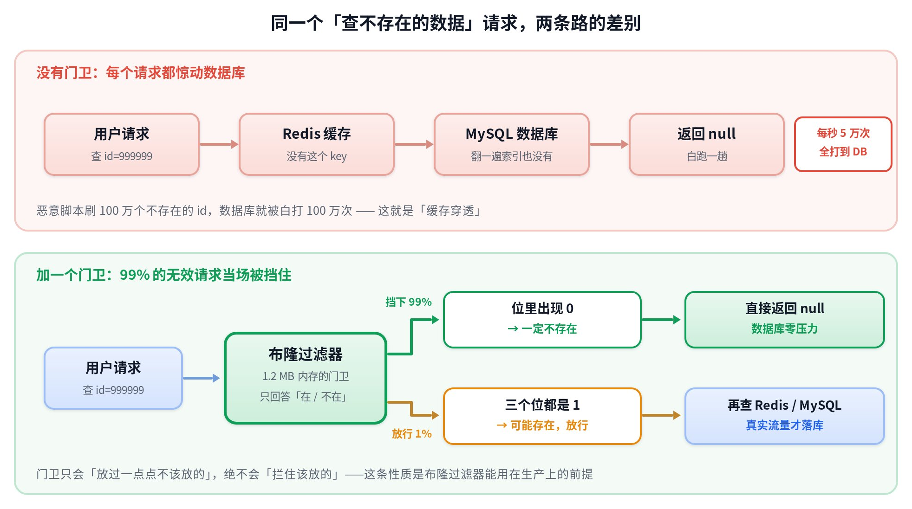
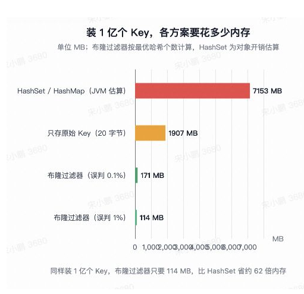
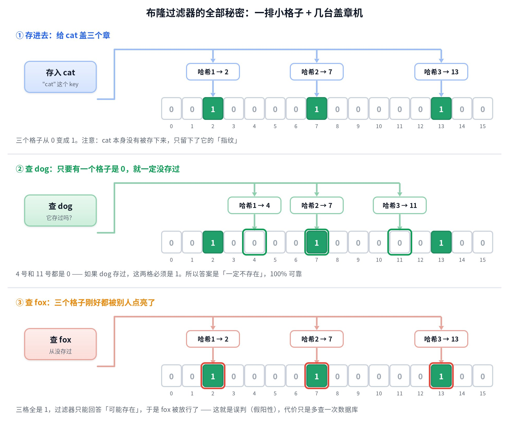
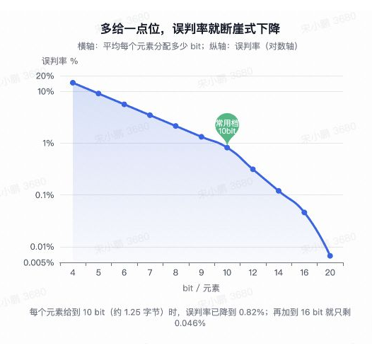
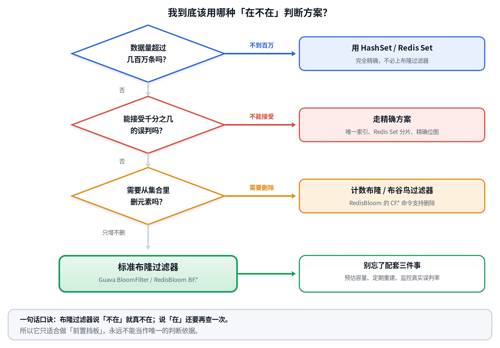

# 布隆过滤器入门：大数据查询里的「门卫大爷」

> 💡 给第一次接触的人的 30 秒版本
>
> - **它是什么**：一张只记「指纹」不记原文的小卡片，用来快速回答「这个 key 在不在」
> - **它可靠的一半**：说「不在」**一定对**，可以直接返回
> - **它不可靠的一半**：说「在」**可能是猜错的**，必须再查一次真库
> - **换来的好处**：装 1 亿个 key 只要 114 MB，比 HashSet 省约 62 倍内存
> - **红线**：只能当前置挡板，永远不能当唯一判断依据

下面三节分别回答三个问题：它替我们省掉了什么麻烦、它内部到底怎么工作、以及真正上线时该怎么配。全文用「体育馆门卫 + 盖章 + 一排小灯泡」这一套比喻讲到底，不换比喻。

---

## 一、它解决了什么问题

先说结果：它解决的不是「查得准」，而是「**别为了确认一件不存在的事，反复惊动最贵的那个系统**」。

### 1.1 先讲个门卫的故事

假设学校体育馆今天只有 500 个报名的同学能进。门口有两种做法。

> ❌ **没有门卫**
>
> - 每个来的人都先进馆，跑到管理室，翻开 500 页的名册一页页找
> - 没找到，再走回来告诉他「你不在名单里」
> - 来 1 万个人瞎凑热闹，管理室就被翻 1 万次

> ✅ **有门卫大爷**
>
> - 大爷手里只有一张小卡片，扫一眼就能说「你肯定没报名，回吧」
> - 大爷说「你好像报了名」的人，才进去翻名册核对
> - 管理室的活一下少了 99%

那张小卡片就是布隆过滤器，管理室就是数据库。把这个故事翻译成后端场景，就是你面试一定会被问到的「**缓存穿透**」：有人拿一堆根本不存在的 id 来刷接口，Redis 里没有，于是每一次都穿过缓存打到 MySQL 上。



注意看下面那条泳道的分叉：门卫只会「多放进去一点点不该放的」，绝不会「拦下真的报了名的人」。这个不对称的性质，是它敢用在生产环境的全部前提。

### 1.2 那为什么不直接把所有 key 塞进内存

这是每个人的第一反应：把 1 亿个存在的 id 全塞进一个 HashSet，查得又快又 100% 准确。问题出在内存账单上。



关键差别在于**存什么**。HashSet 要把 key 原文、哈希值、对象头、指针、桶数组全都留下来，平均每个元素要花掉几十字节；布隆过滤器只留下「这个 key 摸过哪几个格子」，平均 **9.6 个 bit**，也就是 1.2 字节。少存原文，就少了 60 倍内存——代价是它再也说不出「里面到底是哪些 key」，只能回答是非题。

### 1.3 这东西真的在生产里到处都是

它不是面试八股，是你每天用的组件里正在跑的代码。下面这些都是现成的例子。

| 系统 | 它在挡什么 | 省下了什么 |
|---|---|---|
| RocksDB / LevelDB | 点查一个 key 时，先问每个 SST 文件的过滤器「你里面可能有吗」 | 少打开、少读那些肯定没有的文件，把随机磁盘 IO 砍掉一大截 |
| HBase | 按 ROW 或 ROWCOL 粒度过滤 HFile | 同上，避免为一次点查扫多个文件 |
| Cassandra | 每个 SSTable 一个过滤器，误判率可配 | 读放大下降，命中前少做无用功 |
| ORC / Parquet | 列级过滤器写进文件元数据，配合谓词下推 | 大表 `where id = ?` 时直接跳过整个 row group / stripe |
| ClickHouse | 跳数索引 `bloom_filter`、`tokenbf_v1`、`ngrambf_v1` | 等值查询和文本包含查询可以跳过整块数据 |
| Redis（RedisBloom） | 业务层挡缓存穿透、做「这条消息推过没」去重 | DB 压力和重复推送同时下降 |
| 浏览器 / 区块链 | Chrome 早期的恶意网址本地初筛、比特币轻钱包的交易筛选 | 客户端不用下载完整黑名单或全部区块数据 |

共同点很清楚：它们背后那个「真正的查询」都很贵——一次随机磁盘 IO、一次跨网络请求、一次全表扫描。越贵，前面这个 1 MB 的挡板就越划算。

---

## 二、它是怎么实现的

好消息是，这东西的全部原理就两句话：**一排小格子，几台盖章机**。没有树、没有链表、没有排序。

### 2.1 存进去和查出来

准备一排格子（专业叫法是**位数组**，bit array），一开始全是 0。再准备 k 台盖章机（专业叫法是**哈希函数**），每台机器看到同一个 key 会稳定吐出同一个格子编号。

- **存入 cat**：让 3 台机器各算一个编号，把对应格子从 0 改成 1。cat 本身丢掉，不保存。
- **查询 dog**：同样算出 3 个编号，去看这 3 个格子。只要有一个是 0，就说明 dog 从没存过。
- **查询 fox**：3 个格子恰好都被别的 key 点亮过，于是它只能回答「可能存在」。



把第三个场景想透，你就真的懂它了：格子会被不同的 key 共用。cat 点亮的 1，被 fox 借去当成了自己的证据。这就是**误判**（假阳性）的唯一来源——不是哈希算错，而是空间被故意压得太小，大家挤在一起。

### 2.2 三条必须背下来的性质

> ✅ **说「不在」= 100% 可靠**
>
> 如果这个 key 存过，它的 k 个格子必须全是 1。既然出现了 0，它就一定没存过。这一侧没有例外，可以放心短路返回。

> ❗ **说「在」= 只是可能**
>
> 格子全是 1，可能是它自己点的，也可能是别人凑巧点满的。所以这一侧必须回源再查一次，不能直接返回业务数据。

第三条性质是新人最容易栽的坑：**标准布隆过滤器不能删除元素**。你想删 cat，就得把它那 3 个格子改回 0，但其中某个格子可能同时是 dog 的证据，一改就把 dog 也弄丢了，「说不在一定对」这条命就没了。需要删除，得换成 2.5 节里的变体。

### 2.3 位给得越多，误判越少

误判率不是玄学，是一个可以提前算准的数。设 n 是要装的元素个数，m 是格子总数，k 是哈希函数个数，则误判率

$$p = \left(1 - e^{-kn/m}\right)^{k}$$

在 k 取最优值的前提下，它可以简化成一个特别好记的形式：$p \approx 0.6185^{\,m/n}$。也就是说，**平均给每个元素多分一个 bit，误判率就乘以 0.62**。



工程上最常用的档位是每个元素 10 bit，对应误判率 0.82%。要更准也不贵：加到 16 bit（每个元素 2 字节）就降到 0.046%。

### 2.4 盖章机不是越多越好

很多人以为多盖几个章更严格，其实 k 太大反而更糟：每存一个元素就点亮更多格子，位数组很快被涂满，到处都是 1，谁来查都说「可能存在」。


最优解也有公式。先按目标误判率 p 和预计元素个数 n 求出位数 m，再求 k：

$$m = -\frac{n \ln p}{(\ln 2)^2} \qquad k = \frac{m}{n} \ln 2 \approx 0.693 \times \frac{m}{n}$$

好在这两个公式你基本用不上——Guava 和 RedisBloom 都只要你填 n 和 p，m 和 k 由库自己算。真正需要你负责的是那个 n 估得准不准，这一点在 3.1 节展开。

### 2.5 从 20 行玩具代码到生产用法

先看一个能跑的最小实现，理解「盖章」这件事在代码里长什么样。这里用两个哈希值线性组合来模拟 k 个哈希函数，是工业界的标准做法，不必真的写 k 个算法。

```java
public class ToyBloomFilter {
    private final long[] bits;   // 一排小格子，每个 long 装 64 个
    private final int m;         // 格子总数
    private final int k;         // 盖章机台数

    ToyBloomFilter(int m, int k) {
        this.m = m; this.k = k;
        this.bits = new long[(m + 63) / 64];
    }

    private int idx(String key, int i) {
        int h1 = key.hashCode();
        int h2 = Integer.rotateLeft(h1, 16) ^ 0x5bd1e995;
        return Math.floorMod(h1 + i * h2, m);   // 第 i 台机器给出的格子编号
    }

    public void add(String key) {
        for (int i = 0; i < k; i++) {
            int p = idx(key, i);
            bits[p >>> 6] |= 1L << (p & 63);    // 把格子改成 1
        }
    }

    public boolean mightContain(String key) {
        for (int i = 0; i < k; i++) {
            int p = idx(key, i);
            if ((bits[p >>> 6] & (1L << (p & 63))) == 0) return false;  // 见到 0，一定不存在
        }
        return true;   // 全是 1，只能说可能存在
    }
}
```

生产上不要自己写。单机进程内用 Guava，两行就够：

```java
BloomFilter<CharSequence> filter = BloomFilter.create(
        Funnels.stringFunnel(StandardCharsets.UTF_8),
        10_000_000L,   // n：预计要装多少个，宁可估大
        0.01);         // p：能接受的误判率，m 和 k 由库自己算

filter.put("user_10086");
if (!filter.mightContain(id)) {
    return null;       // 一定不存在，直接返回，不碰 DB
}
return queryFromCacheOrDb(id);   // 可能存在，老老实实回源
```

多台服务器要共用一份，就放到 Redis 上（RedisBloom 模块）：

```bash
# 先按 误判率 + 预计容量 建好，别让它自动扩容
BF.RESERVE user:exists 0.01 10000000

BF.ADD    user:exists user_10086      # 单个写入
BF.MADD   user:exists u1 u2 u3        # 批量写入
BF.EXISTS user:exists user_999999     # 返回 0 = 一定不存在；1 = 可能存在

# 需要删除元素时，换成布谷鸟过滤器
CF.RESERVE user:cf 10000000
CF.ADD user:cf user_10086
CF.DEL user:cf user_10086             # 标准布隆没有这个能力
```

---

## 三、最佳实践

原理半小时能懂，真正出事故都出在参数和运维上。这一节全是可以直接抄进你代码 review 清单的东西。

### 3.1 四个参数，只有两个要你操心

| 参数 | 含义 | 怎么定 | 定错的后果 |
|---|---|---|---|
| **n** | 预计要装多少个元素 | 按业务峰值 × 1.5 \~ 2 倍冗余估；宁可多花几十 MB 内存，也别估小 | **最危险**：实际装入量超过 n，误判率会远超设计值 |
| **p** | 能接受的误判率 | 挡缓存穿透 1% 够用；金融风控类初筛用 0.1% \~ 0.01% | 定太小浪费内存，定太大挡不住流量 |
| **m** | 位数组长度 | 由 n 和 p 算出来，库会帮你做；1% 约 9.6 bit/元素，0.1% 约 14.4 bit | 手动瞎填会破坏 p 的保证 |
| **k** | 哈希函数个数 | 同样由库算，`k ≈ 0.693 × m/n`；10 bit 档位下是 7 | 手动调大反而把位数组涂满 |

记住一个直觉就行：**n 估小是事故，n 估大只是多花点内存**。误判率写在文档里是 1%，装满 2 倍的量之后可能变成 10% 以上，这时候你的挡板基本等于没有。

### 3.2 先判断自己该不该用它



两种情况不要用：数据量小到 HashSet 装得下（几十万以内别上复杂度），或者业务要求 100% 精确（比如「用户名是否已被占用」——误判会让新用户注册失败，这属于功能 bug，不是性能优化）。

### 3.3 新人最常踩的五个坑

1. **容量估小，装满了还在写**。位数组涂满之后误判率不是慢慢涨，而是快速失效。做法：上报「已写入量 / 设计容量」这个比值，超过 80% 就告警。
2. **需要删除却用了标准布隆**。想支持删除，就用计数布隆（把每个格子从 1 bit 换成 4 bit 计数器）或布谷鸟过滤器，别自己改回 0。
3. **每台机器各建一份**。8 个实例各存一份 200 MB 的过滤器，不仅浪费 1.6 GB 内存，数据还各不相同。要么集中放 RedisBloom，要么用「Redis 存全量、本地存热点」两层结构。
4. **冷启动忘了预热**。重启后位数组是空的，此时它会把所有请求都判成「不存在」——这会把正常用户的数据也挡掉。做法：预热完成前旁路掉过滤器，直接回源。
5. **把它当成唯一防线**。它只挡「肯定不存在」的 key，挡不住热点 key 击穿、也挡不住有人反复刷同一个存在的 id。空值缓存、限流、互斥重建该配还得配。

### 3.4 上线前逐条打勾

- [ ] n 按峰值留了至少 1.5 倍冗余，并写在代码注释或配置里

- [ ] 选了明确的 p，并在压测里统计过真实误判率，跟设计值对得上

- [ ] 监控项齐了：实际写入量、容量水位、误判率、过滤器拦截的 QPS

- [ ] 有全量重建方案（双 buffer 切换：新过滤器后台构建好再原子替换）

- [ ] 回源路径上有空值缓存和限流，过滤器不是唯一防线

- [ ] 明确了「删除元素」的场景怎么处理：要么重建，要么换布谷鸟过滤器

---

## 四、一分钟回顾

> 📌 如果只能带走三句话
>
> - 它用「只记指纹、不记原文」换来了 60 倍的内存节省，代价是极小概率的误判
> - 说「不在」可以直接信，说「在」必须再查一次——这个不对称性是它的全部价值
> - 事故几乎都来自容量估小和不能删除这两点，参数和运维比原理更值得你花时间

想真正记住，花 20 分钟做一件事：用 Guava 建一个 `n=100000, p=0.01` 的过滤器，塞进 10 万个 `user_0` 到 `user_99999`，然后拿 10 万个 `evil_0` 到 `evil_99999` 去查，数一数有多少个被判成「可能存在」。你会得到一个接近 1000 的数字。那一刻，误判率就不再是一个公式了。

---

原文：[布隆过滤器入门：大数据查询里的「门卫大爷」](https://bytedance.larkoffice.com/docx/CdkSdi4YWoU303x7TgAczWwvnKf)
