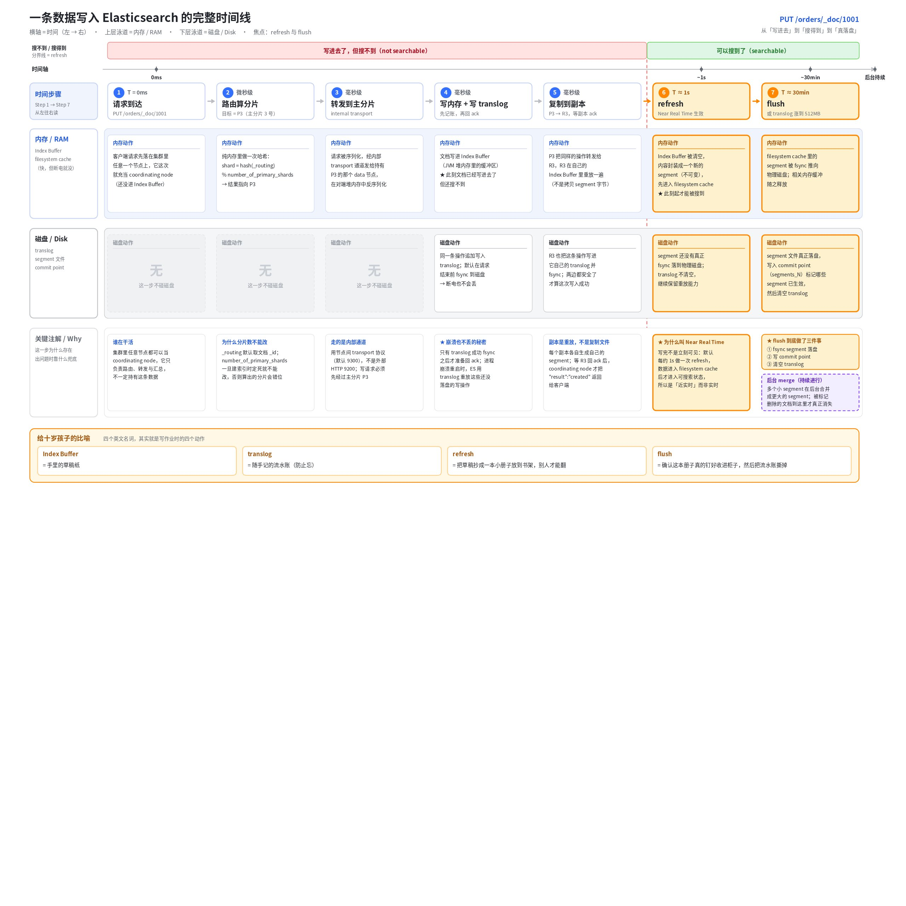
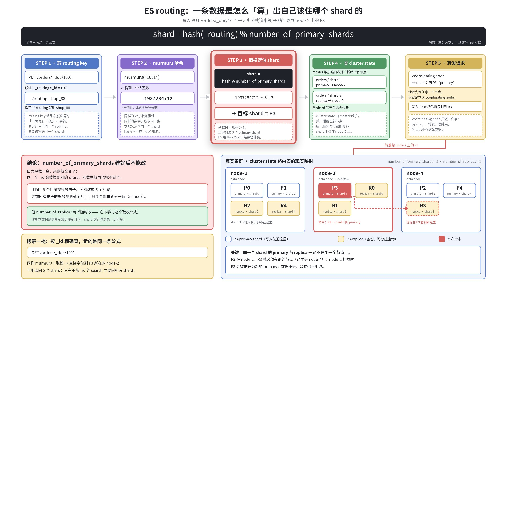
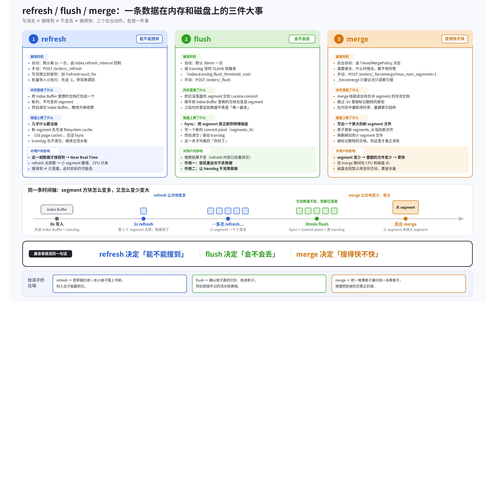
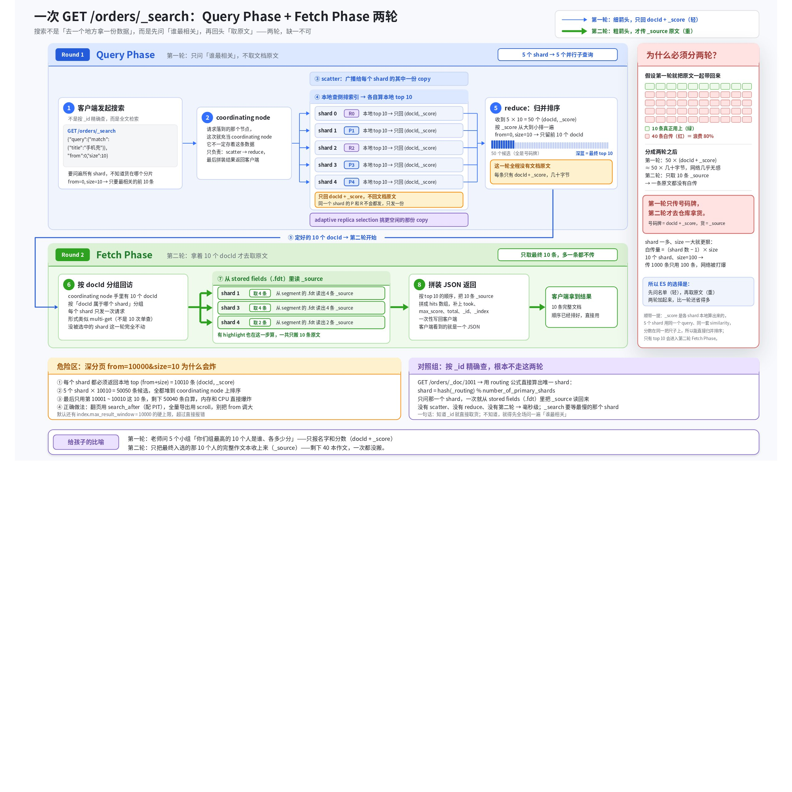
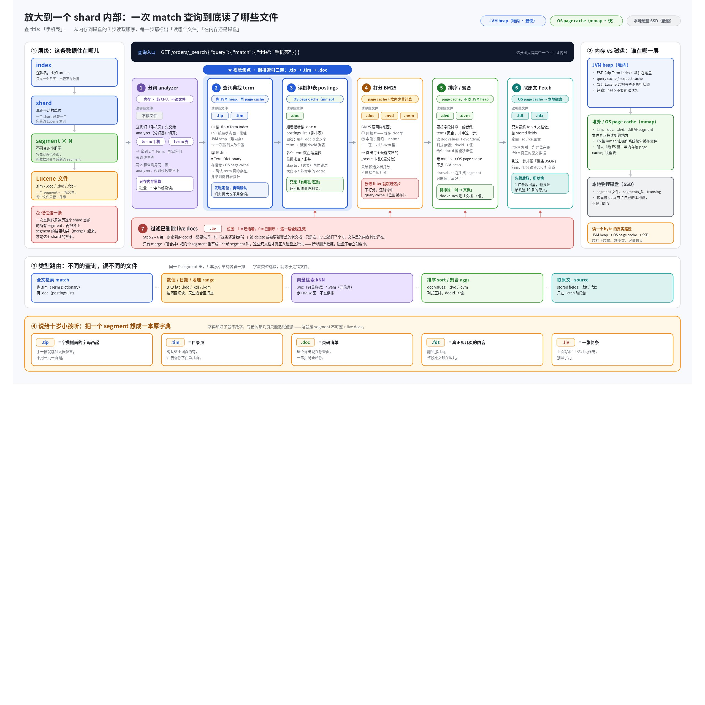
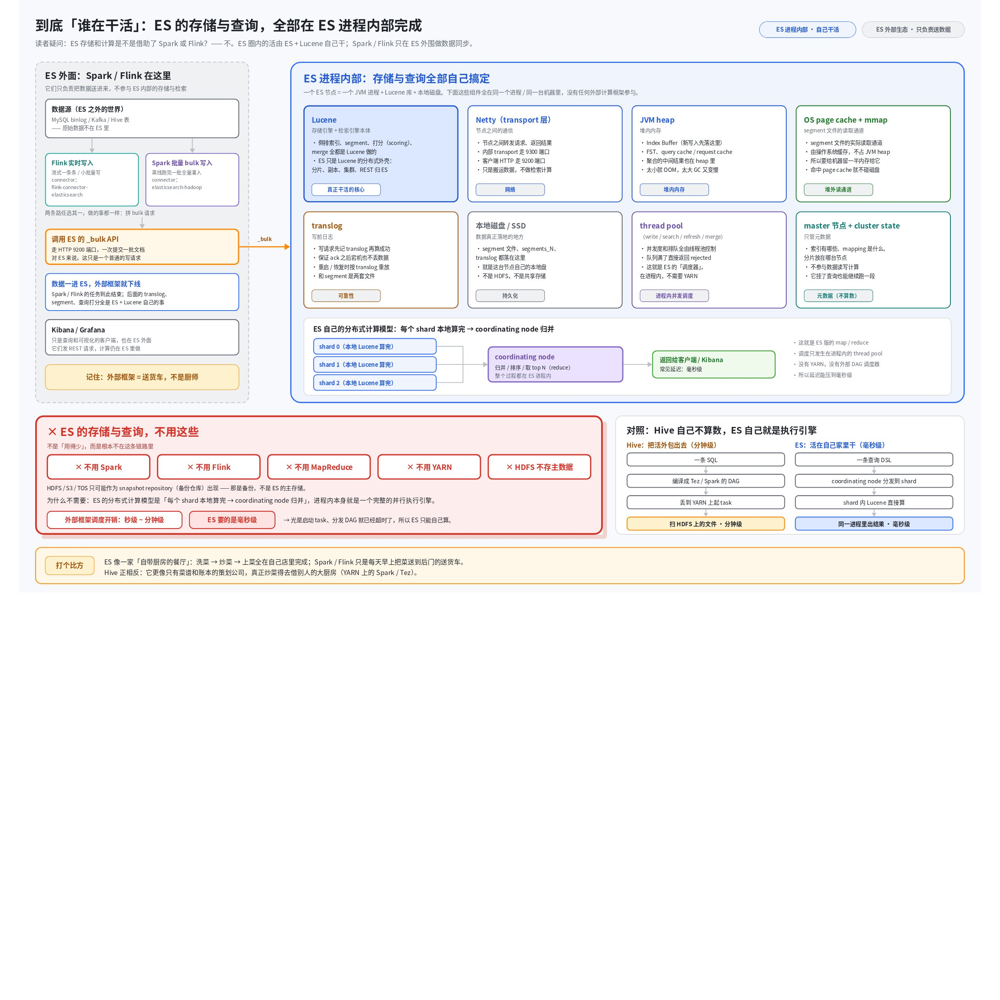

# ES 存储与查询全过程：一条数据从进门到被搜到

> **📌 四句话先立住主线**
>
> - **写进去 ≠ 搜得到**：默认 1 秒后 refresh 才可见。
> - **搜得到 ≠ 不会丢**：防断电靠 translog，不靠 refresh。
> - **查询要问两轮**：先要号码牌，再取原文。
> - **全程不用 Spark / Flink**：ES 自己就是执行引擎。

下面每一节都配一张画板。你可以把画板当主线看，文字只是给画板配的旁白。

---

## 一、开场只要三个词

ES 的所有概念里，先只记这三个。剩下的都能等。

| 词 | 它是什么 | 十岁小孩版 |
|---|---|---|
| **index** | 一个逻辑名字，比如 `orders`。它不存数据。 | 书架上贴的标签：「订单」 |
| **shard** | 真正存数据、真正干活的单位。一个 shard 就是一个完整的 Lucene 索引。 | 标签下面真正摆着的那几个书格 |
| **segment** | shard 内部一个个**不可变**的小索引文件包。查询要把它们全走一遍。 | 书格里一本本写好就不再改的小册子 |

还有一句得说明白：**ES 自己不写存储引擎，它是 Lucene 的分布式外壳**。倒排索引、segment、打分、merge 全是 Lucene 做的；ES 负责把请求路由到正确的机器、管副本、管集群状态。后面所有"内存里干了什么、磁盘上干了什么"，实际执行者基本都是 Lucene。

---

## 二、写入：一条数据的旅程

先看完整时间线。横轴是时间，上半条泳道是内存，下半条是磁盘。



这张图里有个反直觉的点：**ES 在返回"写入成功"的时候，这条数据其实还搜不到**。它只保证"不会丢"，不保证"马上能查"。这两件事是被故意拆开的，因为它们的代价完全不同。

### 2.1 先算它该去哪个抽屉

请求可以打到集群里任何一个节点。收到请求的那个节点，这一次就充当 **coordinating node**，第一件事是算：这条数据该归哪个 shard 管。



公式只有一行：

```text
shard = hash(_routing) % number_of_primary_shards
```

默认 `_routing` 就是文档的 `_id`。同一个 id 每次哈希出同样的数字，取模得同样的余数，所以**同一条数据永远落在同一个 shard**——这是后面能按 id 一次命中的前提。

> **❗ 主分片数建完不能改**：除数一变，所有老数据的余数全变，等于地址全废，只能 reindex 重排一遍。
>
> 五个抽屉按号放袜子，突然改成六个抽屉，之前的编号规则就全乱了。
>
> **副本数可以随时改**，因为它不出现在这条公式里。

### 2.2 写内存，同时记流水账

请求转到主分片所在的 data 节点后，那台机器做两件事，一件在内存，一件在磁盘：

- **内存**：文档进 **Index Buffer**（JVM 堆里的一块缓冲区）。此刻它还没变成 segment，所以搜不到。
- **磁盘**：同一条操作被追加写进 **translog**，并且**在返回响应之前就 fsync 落盘**。

顺序很关键。内存里的东西一断电就没了，所以 ES 不敢只靠内存就告诉你"成功"。它先把"我要做这件事"记在磁盘的流水账上，再去做。机器挂了重启，读一遍 translog 重放，内存里丢的那批就补回来了。

然后主分片把同样的操作转发给副本分片。注意**转发的是操作，不是文件字节**：副本自己重放一遍、自己生成自己的 segment。等副本也确认了，才给客户端回 `"result":"created"`。

### 2.3 三个后台动作

数据进来之后，ES 在背后一直做三件事。这三件事最容易被混成一件，图里按"内存做什么 / 磁盘做什么"拆开了。



**refresh**（默认每 1 秒）把 Index Buffer 里攒的文档封成一个新 segment，然后清空 buffer。这个新 segment 先落在 **filesystem cache**，还没 fsync。但它已经是一个合法的 Lucene 索引了，所以**这一刻数据才搜得到**。ES 号称的 Near Real Time，说的就是这一秒。

**flush**（默认 30 分钟，或 translog 攒到 512MB）才是真正的落盘：fsync 把 segment 刷到物理磁盘，写一个新的 commit point（`segments_N`），然后清空 translog。它不改变你能搜到什么，只负责让流水账别无限长大。

**merge** 是后台把一堆小 segment 重写成一个大 segment。为什么要合？因为一次查询必须遍历这个 shard 的**所有** segment，册子越多越慢。顺便，之前被标记删除的文档，也只有在 merge 重写的时候才真正从磁盘上消失。

> **⭐ 一句话分工**：refresh 决定**能不能搜到**，flush 决定**会不会丢**，merge 决定**搜得快不快**。

---

## 三、查询：两轮问答

写入讲完，反过来看查。一次 `_search` 不是一趟就完事，是两趟。



### 3.1 为什么非要分两轮

假设索引有 5 个 shard，你要 `size: 10`。

第一轮 **Query Phase**，coordinating node 把请求同时发给 5 个 shard（每个 shard 只发给它的一份 copy，主或副本都行）。每个 shard 在本地查自己的倒排索引，算出自己最相关的 10 条，**只回 docId 和 _score**。协调节点收到 50 个"号码牌 + 分数"，排序，取出全局前 10。

第二轮 **Fetch Phase**，协调节点拿着最终这 10 个 docId 回到对应 shard，去 segment 的 stored fields 里读出 `_source`，拼成 JSON 返回。

如果第一轮就把原文带回来，那就是传了 50 条完整文档，最后只用 10 条，40 条纯属白传。分片一多、`size` 一大，网卡先撑不住。所以第一轮只报名字和分数，第二轮才把作文本收上来。

> **❗ 深分页为什么危险**：`from=10000&size=10` 时每个 shard 都要返回 10010 个 (docId, score)，5 个 shard 就是 50050 条挤在协调节点上排序。用 `search_after` 或 `scroll` 替代。

### 3.2 钻进一个 shard 里看

上面说"shard 在本地查自己的倒排索引"，这句话展开就是下面这张图：一次查询依次读了哪些文件，哪些在内存、哪些在磁盘。



核心是三连跳。`.tip` 是 Term Index，用 FST 把词的前缀压成一张状态图，**常驻 JVM 堆**，作用是"一摸就跳到大概位置"；`.tim` 是完整词典，确认这个词确实存在并给出指针；`.doc` 是倒排表，告诉你这个词出现在哪些 docId 里。多个词的时候，在这一步做位图求交。

再往后按需要读：要打分读 norms，要排序或聚合读 **doc values**（列式存储，docId 到值的映射），要原文读 **stored fields**。整个过程有一张 `.liv` 位图一直在旁边，把已删除的文档剔掉。

存储位置这里要讲清楚，这是最容易问错的一点：**segment 文件在 data 节点自己的本地磁盘上，不在 HDFS**。ES 用 mmap 把文件映射进地址空间，让操作系统的 page cache 帮它缓存热数据。所以"给 ES 的机器留一半内存别都给 JVM"不是玄学——那一半是给 page cache 的。HDFS / S3 / TOS 在 ES 里只可能作为 snapshot 备份仓库出现，不做主存储。

### 3.3 按 _id 查是走后门

`GET /orders/_doc/1001` 不走上面那两轮。它直接套 2.1 那条路由公式，算出唯一的 shard，一次就把原文拿回来。所以按主键查和搜索是两种完全不同的开销，别放在一起比。

---

## 四、这一路谁在干活

回答那个具体疑问：ES 存储和计算的时候，是不是借了 Spark 或 Flink？



**没有。ES 的存储和查询完全在自己进程里完成。** 参与的只有：Lucene（存储与检索本体）、Netty（节点间转发）、JVM heap（Index Buffer、FST、各种 cache）、OS page cache（读 segment 文件）、translog、本地磁盘、以及 write / search / refresh / merge 几个 thread pool。master 节点只管元数据，连数据读写都不参与。

原因也简单：ES 的并行模型是**每个 shard 在本地算完，协调节点归并**。这本身就是一个完整的并行执行引擎，再套一层外部调度框架只会变慢。Spark 起一个 job 的调度开销是秒级到分钟级，ES 要的是毫秒级，量级根本不匹配。

Spark 和 Flink 确实存在，但站在门外：从 Kafka、MySQL binlog、Hive 表里读数据，调 ES 的 `_bulk` API 灌进来。数据一进 ES，后面全是 Lucene 的事。Kibana、Grafana 同理，只是查询端的客户端。

和 Hive 正好相反。**Hive 自己不算数**：它把 SQL 编译成 Tez 或 Spark 的 DAG，扔到 YARN 上起一堆 task 去扫 HDFS 文件，延迟分钟级。ES 是自带厨房的餐厅，洗菜炒菜上菜全在店里；Hive 是只有菜谱和账本的策划公司，真要炒菜得去借别人的大厨房。

---

## 五、完整时间表

把前面所有节点按时间排成一张表。这张表是全文的压缩版。

| 时刻 | 内存里发生什么 | 磁盘上发生什么 | 搜得到吗 | 断电会丢吗 |
|---|---|---|---|---|
| T=0 请求到达 | 算路由，定 shard | 无 | 否 | 会 |
| T≈0 写主分片 | 进 Index Buffer | translog 追加 + fsync | 否 | 不会 |
| T≈0 复制副本 | 副本各自进自己的 buffer | 副本各自写自己的 translog | 否 | 不会 |
| T≈1s refresh | buffer 封成新 segment 并清空 | segment 落 filesystem cache，未 fsync | 是 | 不会 |
| T≈30min flush | 交给 Lucene commit | fsync segment + 写 segments_N + 清 translog | 是 | 不会 |
| 后台 merge | 读存活文档重排 | 写大 segment，删旧文件，删除数据真正消失 | 是 | 不会 |

看这张表最该记住的是第二行和第四行的差别：**translog 那一刻数据已经安全了，但要再等一次 refresh 才看得见。**

---

## 六、动手把上面的现象跑出来

这些命令在 Kibana Dev Tools 里贴进去就能跑，跑一遍比看十遍图管用。

**① 亲手制造一次「写进去了但搜不到」**

```json
PUT /demo_orders/_doc/1001
{ "title": "手机壳", "shop": "shop_88" }

# 立刻查，大概率 hits 为空，因为还没 refresh
GET /demo_orders/_search
{ "query": { "match": { "title": "手机壳" } } }

# 手动 refresh 一次
POST /demo_orders/_refresh

# 再查，这次有了
GET /demo_orders/_search
{ "query": { "match": { "title": "手机壳" } } }
```

**② 看 segment：refresh 让它变多，merge 让它变少**

```json
GET /_cat/segments/demo_orders?v&h=shard,prirep,segment,docs.count,docs.deleted,size,committed,searchable

# committed=false 表示还没 flush；searchable=true 表示已经 refresh 过
# docs.deleted 就是等着被 merge 清掉的墓碑
```

**③ 看 translog 有多大、refresh/flush/merge 各跑了多少次**

```json
GET /demo_orders/_stats/translog,refresh,flush,merge
```

**④ 验证路由公式：这条数据到底在哪个 shard**

```json
GET /demo_orders/_search_shards?routing=1001
```

> **💡 下一步**：这篇只讲了"数据怎么进、怎么出"。真正影响线上表现的还有两块——mapping 与 analyzer 决定倒排索引长什么样，分片大小与副本数决定集群扛不扛得住。想继续往下钻的话，从 `GET /_cat/shards?v` 看自己集群的真实分片分布开始最直接。
