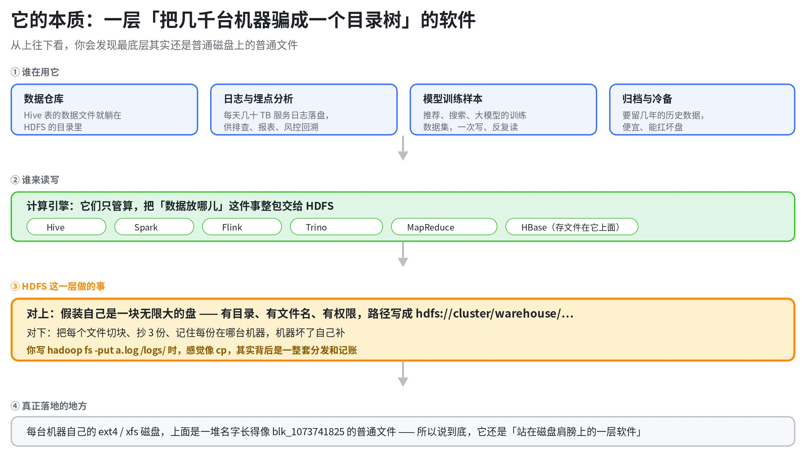
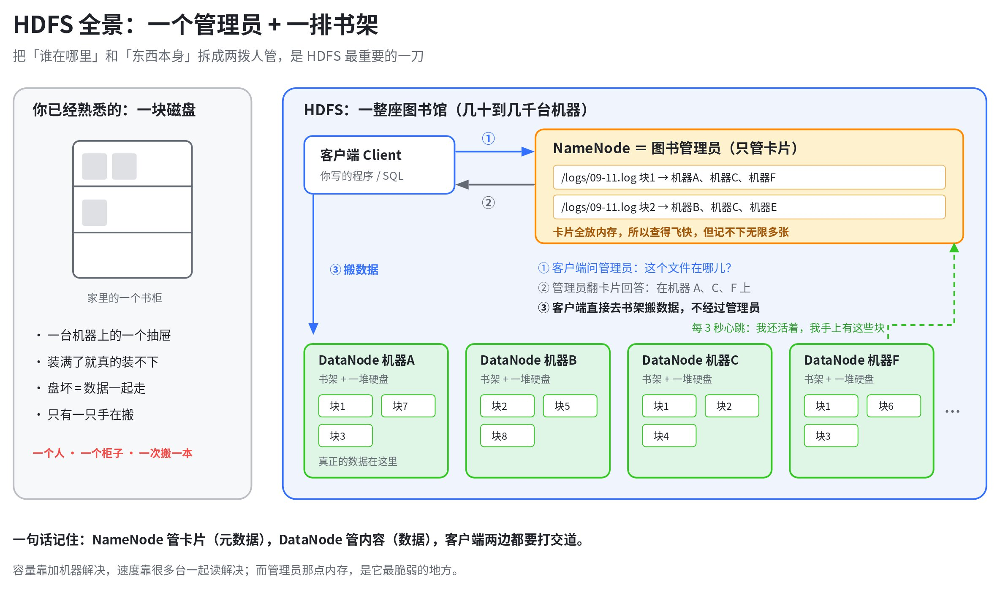
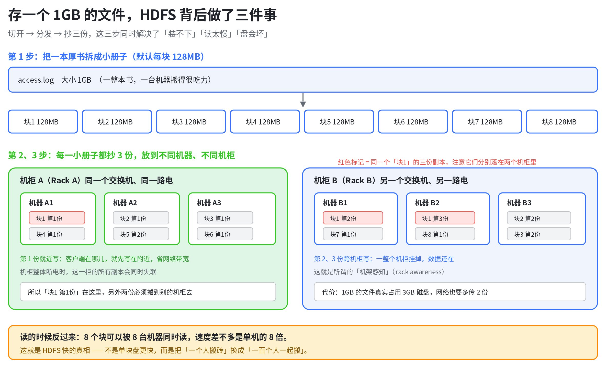
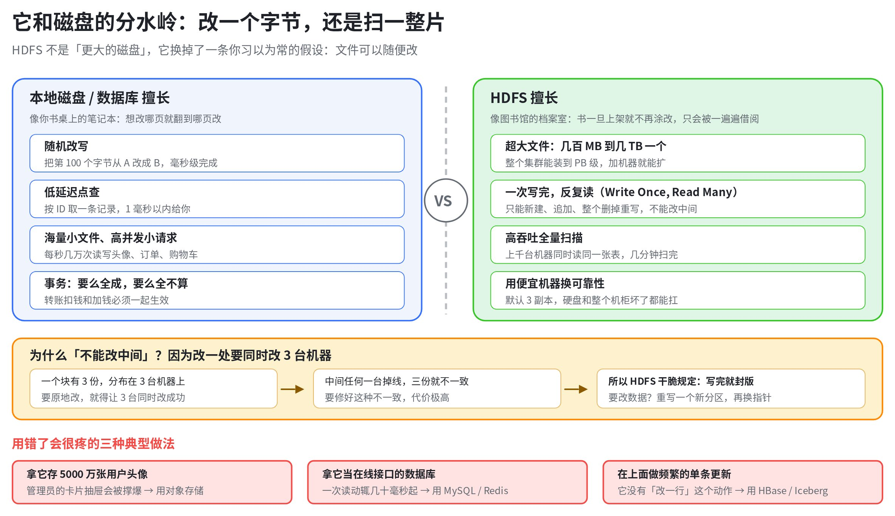
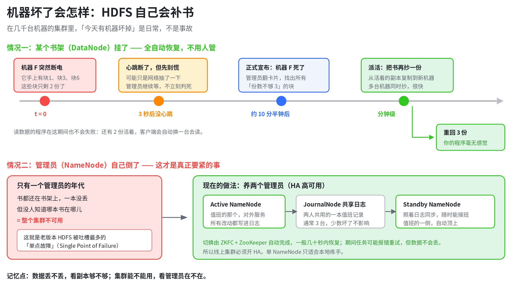
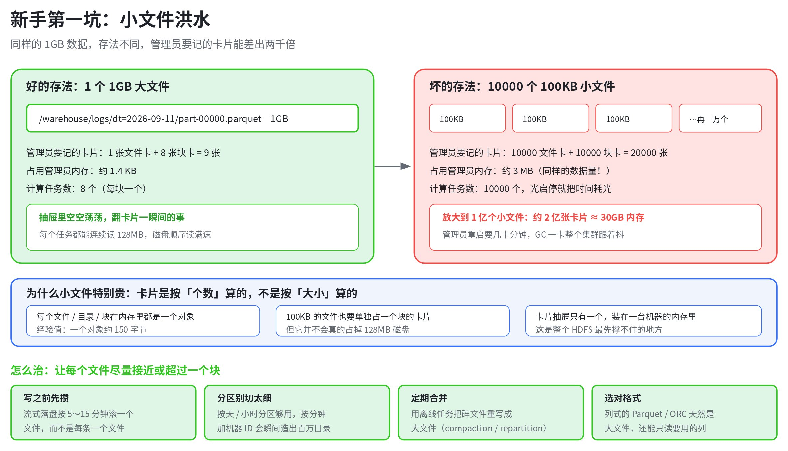

# HDFS 入门：它不是一块大磁盘，而是一座会自己补书的图书馆

> 💡 **先记住这四句**
>
> - **本质**：一层软件，把上千台机器的普通磁盘装成一棵目录树。
> - **擅长**：巨大的文件一次写完，然后被反复整片扫描。
> - **不擅长**：改文件中间、按 ID 点查、海量小文件。
> - **最疼的坑**：小文件把 NameNode 的内存撑爆。

你说「它大概就是一个磁盘」，这个直觉有一半是对的：用起来真的很像。你敲 `hadoop fs -ls /logs`，它给你目录；你敲 `-put`，感觉就是 `cp`。但另一半差得很远——磁盘是一块硬件，HDFS 是一层**软件**，它站在几百上千块磁盘的肩膀上，靠一整套「记账 + 分发 + 补书」的规则，假装自己是一块无限大的盘。

这篇东西按这个顺序讲：它到底是什么 → 它解决了什么 → 和磁盘差在哪 → 谁在用 → 哪里会疼。图比字多，看图就够。

---

## 一、本质：一层「把几千台机器骗成一个目录树」的软件

先把最容易被跳过的一层挖出来：HDFS 的最底下，其实**还是普通磁盘上的普通文件**。你在 HDFS 里存的 `access.log`，落到某台机器上会变成几个名字像 `blk_1073741825` 的文件，躺在那台机器的 ext4 或 xfs 分区里。



所以它不是「一个更大的磁盘」，而是磁盘之上的一层**翻译官**：对上，它提供目录、文件名、权限这些你熟悉的东西；对下，它把文件切块、抄副本、记住每一份在哪台机器。这层翻译带来的代价是「多了一跳」——每次读写都要先问一次「东西在哪」，所以它的单次延迟天生比本地磁盘高一个量级。

## 二、三个角色：谁记账，谁搬砖

把 HDFS 想成一座图书馆，只有三个角色，记住它们就够了。



**NameNode** 是图书管理员，手里只有卡片：哪个文件、切成了几块、每块的三份分别在哪台机器。卡片全部放在**内存**里，所以查得飞快。**DataNode** 是书架，只管存块、按要求交出块，每 3 秒向管理员报一次心跳。**客户端**就是你的程序：先问管理员位置，再直接去书架搬数据——数据本身**不经过**管理员，否则管理员就成了瓶颈。

这里有个必须提前埋下的因果：管理员的卡片抽屉是**一台机器的内存**。经验值是每个文件、目录、块在内存里约占 150 字节[[1]](https://www.cloudera.com/blog/technical/small-files-big-foils-addressing-the-associated-metadata-and-application-challenges.html)。所以 HDFS 的容量可以靠加机器无限扩，但「文件个数」不行——这是它整套设计里最硬的那面墙，后面的第七节全部由它推导出来。

---

## 三、它解决了什么：装不下、读太慢、盘会坏

这三件事本来要你自己写代码解决，HDFS 用同一套动作一次解决了。

### 3.1 装不下

一块企业级硬盘现在是 20TB 量级。一个中等规模业务一天产生几十 TB 日志，你根本没有「一块盘」可以放。HDFS 的答案很土：一个文件切成小块，散到很多台机器上，容量不够就加机器。

### 3.2 读太慢

单块盘顺序读大约 200MB/s，扫 10TB 数据要接近 14 小时。同样的数据切成块散在 100 台机器上，100 台同时读，理论上十分钟量级就扫完了。**HDFS 的快，不是单块盘更快，而是把「一个人搬砖」换成「一百个人一起搬」。**

### 3.3 盘会坏

机器到了几百上千台，「今天有盘坏了」就是每天都在发生的事，而不是事故。所以每个块默认存 3 份，还要故意分到不同机柜——一整个机柜断电时，数据仍然活着。



代价写在图里了：1GB 的文件真实占用 3GB 磁盘，写的时候网络要多传两份。这是 HDFS 用钱换可靠性的地方，也是后面纠删码要优化的地方。块大小和副本数都是可调的（`dfs.blocksize`、`dfs.replication`），默认 128MB / 3 份，不少公司把块调到 256MB 以减少卡片数量。

---

## 四、和磁盘的真正区别：写完就封版

容量、速度都只是量的差别。**质**的差别只有一条：本地磁盘上的文件你想改哪里改哪里，HDFS 上的文件**写完就封版**——只能新建、在末尾追加、或者整个删掉重写，不能回头改中间那一段。



把同一件事放到两边对比，边界会更清楚：

| 你想做的事 | 一块本地磁盘 | HDFS |
|---|---|---|
| 存一个 500GB 的文件 | 单盘勉强，超过盘容量就没救 | 自动切块散到多台，PB 级也装得下 |
| 改第 100 个字节 | 一次 seek + write，毫秒级 | **做不到**，只能追加或整体重写 |
| 全量扫 10TB | 顺序读约 200MB/s，接近 14 小时 | 上百台并行，**十分钟量级** |
| 按 ID 取一条记录 | 毫秒级 | 几十毫秒起步，而且它没有索引 |
| 一块盘坏了 | 数据丢，靠你自己有没有备份 | 默认 3 副本，自动补回来 |
| 存 1000 万个 100KB 小文件 | 文件系统扛得住 | 能存，但 NameNode 内存扛不住 |

「写完就封版」听起来像残废，其实是它敢做 3 副本的前提：一个块有三份在三台机器上，要支持原地修改，就得让三台同时改成功；中间任何一台掉线，三份就不一致，修起来代价极高。HDFS 干脆把这个问题**从需求里删掉了**。所以数仓里改数据的标准动作不是 update，而是「重算一个新分区，再把指针切过去」。

---

## 五、机器坏了会怎样

新手最常问的问题：机器天天坏，那我的数据到底会不会丢？把两种故障分开看就清楚了。



DataNode 挂掉是**全自动**的：管理员等约 10 分半钟（两轮 5 分钟的复查 + 10 次心跳）才宣布它死亡，然后把副本数不足的块从活着的副本再抄一份到新机器。这段时间里你的程序一般毫无感觉——还有两份活着，客户端会自动换一台去读。

NameNode 挂掉才是大事：书一本没丢，但没人知道哪本书在哪儿，整个集群不可用。这就是老版本 HDFS 被吐槽的「单点故障」。现在的标准做法是养两个管理员（Active / Standby），共用一份写在 JournalNode 上的值班记录，靠 ZKFC + ZooKeeper 自动切换。**线上集群必须开 HA**，单 NameNode 只适合你在本地练手。

---

## 六、你会在哪儿撞见它

作为后端，你大概率不会直接调 HDFS 的 API，但你的数据一定会流过它。

| 场景 | 为什么用它 | 你会看到的东西 |
|---|---|---|
| 数据仓库 | Hive / Spark 表的数据文件就是 HDFS 上的目录和文件，分区就是子目录 | `/user/hive/warehouse/db.db/t/dt=2026-09-11/part-00000.parquet` |
| 日志与埋点 | 服务日志按天落盘，供排查、报表、风控回溯，一次写多次读 | Kafka → Flink / Spark → HDFS 落盘目录 |
| 模型训练样本 | 训练数据集特别大，读取模式是整批顺序扫，正中它的强项 | 训练任务里那串 `hdfs://` 开头的输入路径 |
| 归档与冷备 | 要留几年的历史数据，便宜、能扛坏盘 | 按年月分层的历史分区、纠删码目录 |

反过来，有三种需求千万别塞给它：在线接口的数据库（延迟不够）、海量小图片小附件（卡片撑爆管理员）、需要频繁改单条记录的存储（它没有「改一行」这个动作）。这三件事分别该找 MySQL / Redis、对象存储、HBase 或 Iceberg。

---

## 七、坑与最佳实践

### 7.1 第一坑：小文件洪水

这是新手 90% 的事故来源，而且它不会立刻报错，只会让集群一天天变慢，直到某次 NameNode 重启要几十分钟。



关键在于卡片是按**个数**算的，不是按**大小**算的。同样 1GB 数据，存成一个大文件是 9 张卡片，存成一万个小文件就是两万张。放大到一亿个小文件，就是 30GB 内存的量级，管理员一次 GC 全集群跟着抖。**目标很简单：让每个文件尽量接近或超过一个块。**

### 7.2 另外五个会让你加班的坑

- **把 3 副本当备份**：副本防的是硬盘坏，不防你手抖 `-rm -r`，也不防上游算错。真备份靠 Trash（`fs.trash.interval`）、快照（`createSnapshot`）和跨集群 distcp。
- **用 gzip 压一个大文件**：gzip 不可切分，一个 10GB 的 `.gz` 只能被一个任务从头读到尾，并行度直接掉到 1。换 Parquet / ORC，压缩用 Snappy 或 zstd。
- **对 GB 级文件直接 `-cat` 或 `-get`**：会把整份数据拉到你登录的那台网关机上，刷爆终端或塞满本地盘。要看内容就 `-cat | head`，要下载先想清楚多大。
- **把文件当消息队列，写了不 close**：没有 `close` 或 `hsync` 之前，别的程序看到的文件长度可能是 0。别用「边写边读同一个文件」来做实时。
- **把 HDFS 权限当安全边界**：没开 Kerberos 时，用户名基本靠客户端自称，看起来有权限控制，其实拦不住人。

### 7.3 一份可以直接照做的清单

- **文件大小**：单个文件目标 ≥ 一个块（128MB 或 256MB）；流式落盘按 5～15 分钟滚一个文件，别一条一个。
- **分区粒度**：按天或小时分区够用；按分钟再叠机器 ID，能瞬间造出百万级目录。
- **格式**：列式（Parquet / ORC）+ 可切分压缩，既是大文件，又能只读用到的列。
- **定期合并**：给碎文件目录配一个 compaction 任务，别等 NameNode 告警才动手。
- **护栏**：重要目录开 Trash、快照和目录配额（`dfsadmin -setQuota`），定期 `fsck` 看有没有块副本不足。
- **冷数据换纠删码**：省一半空间，见下表。

纠删码（Erasure Coding）是 3 副本之外的另一条路：用数学校验块代替整份拷贝，官方默认策略 RS-6-3 的存储开销不超过 50%，而 3 副本是 200%[[2]](https://hadoop.apache.org/docs/current3/hadoop-project-dist/hadoop-hdfs/HDFSErasureCoding.html)。

| 方式 | 存 1PB 真实占用 | 能扛几台同时坏 | 代价 |
|---|---|---|---|
| 3 副本（默认） | 3PB | 任意 2 台 | 存储贵，但读得快、坏了恢复简单 |
| 纠删码 RS-6-3 | **1.5PB** | 任意 3 个块 | 读要现算，重建吃 CPU 和网络，适合冷数据 |

---

## 八、动手五分钟，手感比文档重要

找一个测试集群，把下面几条敲一遍，前面所有概念都会落地。

```bash
# 看目录，跟 ls 一样
hadoop fs -ls /user/hive/warehouse/

# 这个目录占了多少空间，跟 du -h 一样
hadoop fs -du -h /user/hive/warehouse/

# 上传和下载
hadoop fs -put ./access.log /tmp/demo/
hadoop fs -get /tmp/demo/access.log ./

# 只看开头，别对 GB 级文件直接 -cat
hadoop fs -cat /tmp/demo/access.log | head -20

# 最值得敲的一条：这个文件切成了几块，每块的三份在哪台机器上
hdfs fsck /tmp/demo/access.log -files -blocks -locations

# 集群还剩多少空间、有没有掉线的 DataNode
hdfs dfsadmin -report
```

那条 `fsck` 会把第三节那张图变成你眼前的真实输出：块 ID、块大小、三个副本各自在哪台机器。看过一次，「文件被切块散在多台机器上」这句话就再也不抽象了。

---

## 九、收尾：换掉的是一个提问方式

回到你最初的那句「它大概就是一个磁盘」。学完这一遍，真正变化的不是你多背了几个组件名，而是**你看存储系统时的第一个问题变了**：不再问「它有多大」，而是问「它假设我怎么用它」。HDFS 的假设写得明明白白——文件很大、一次写完、反复整片读、机器随时会坏。踩在这个假设上，它便宜又结实；逆着它用，怎么调参都疼。

顺手说一句边界：现在越来越多团队把底座换成对象存储加 Iceberg / Hudi，HDFS 在新集群里的份额在降。但「切块、一次写多次读、单独一个元数据服务、副本或纠删码」这套概念一个都没变，你在这篇里建立的心智模型可以直接搬过去。

> 📌 **下次遇到一个陌生存储，先问这三句**
>
> - 它的元数据放在哪，会不会成为瓶颈？
> - 它允许我改已有数据吗，还是只能重写？
> - 它按什么单位收费——空间、请求数，还是文件个数？

## 参考资料

### 其它来源

- [[1] Solving Metadata Issues from Small Files | Cloudera](https://www.cloudera.com/blog/technical/small-files-big-foils-addressing-the-associated-metadata-and-application-challenges.html)
- [[2] Apache Hadoop 3.5.0 – HDFS Erasure Coding](https://hadoop.apache.org/docs/current3/hadoop-project-dist/hadoop-hdfs/HDFSErasureCoding.html)
