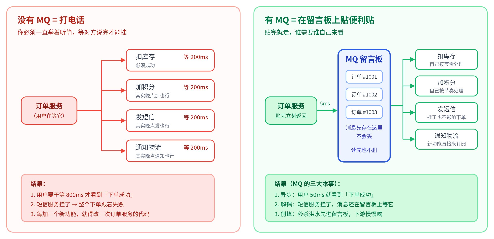
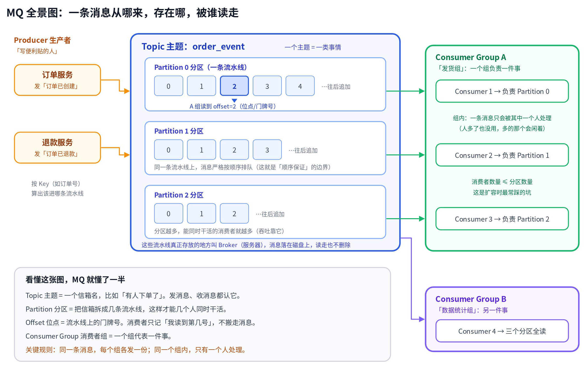
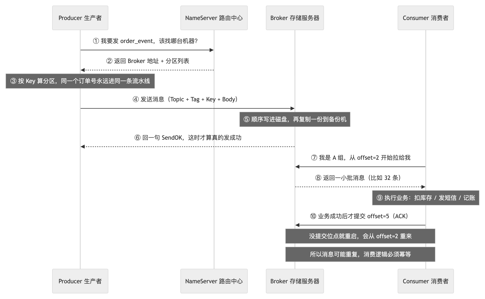
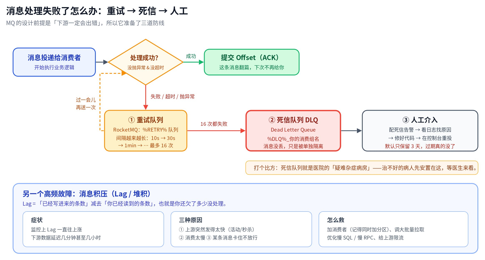
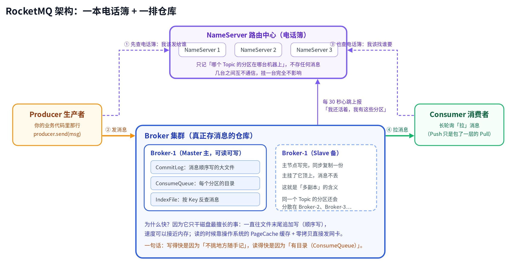
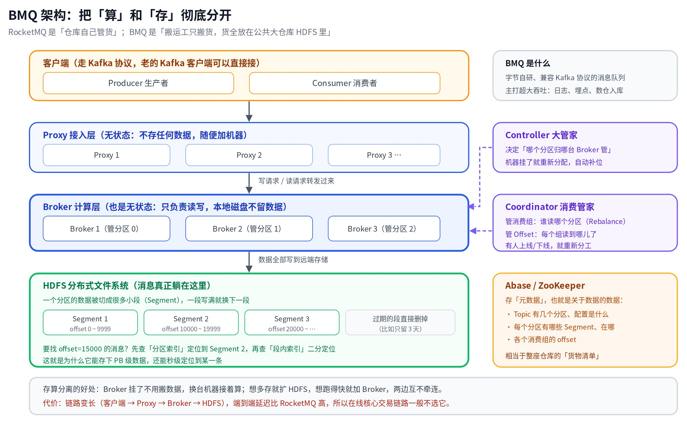
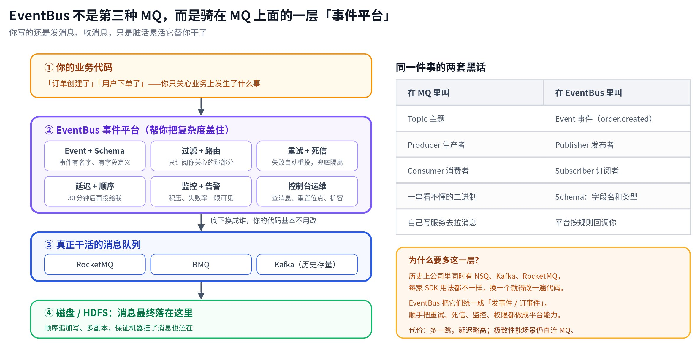
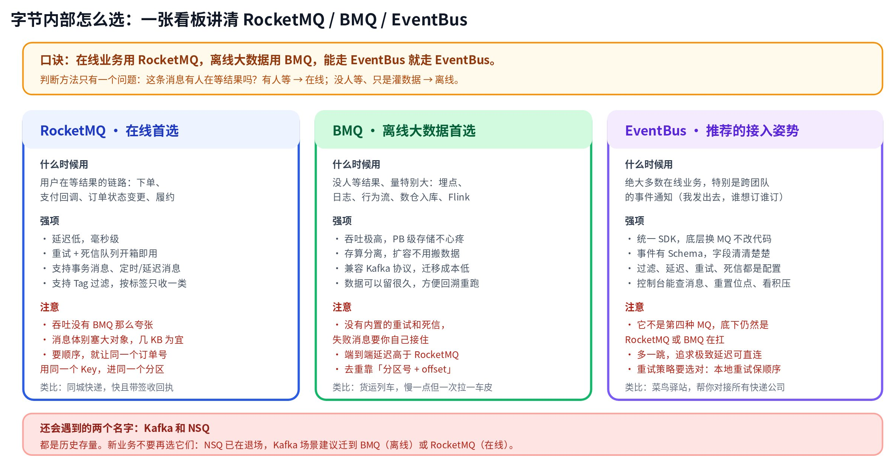

# MQ 从零讲起：一篇给新手后端的「消息队列」说明书

> 📌 **30 秒速览（先记住这 5 句话，后面全是展开）**
>
> 1. MQ 就是一块**公共留言板**。以前 A 服务要打电话给 B 服务并干等，现在 A 把纸条往板上一贴就走，B 自己来取。
> 2. 它换来三样东西：**异步**（不用等）、**解耦**（对方挂了我照样活）、**削峰**（洪水先蓄着，下游慢慢喝）。
> 3. 核心就 5 个词：**Topic**（信箱名）、**Partition**（几条流水线）、**Producer**（写纸条的）、**Consumer Group**（取纸条的小组）、**Offset**（读到第几号了）。
> 4. 消息处理失败不会消失：先**重试**，重试到头进**死信队列**，然后等人来救。
> 5. 字节内部：**在线业务用 RocketMQ，离线大数据用 BMQ，能走 EventBus 就走 EventBus**（EventBus 不是第三种 MQ，它是骑在 MQ 上的一层平台）。

这篇文章假设你完全没碰过消息队列。我会尽量用「寄快递、贴便利贴、流水线」这种大白话把它讲完，全程配图。读完你应该能做到三件事：看懂同事口中的 Topic / 分区 / 位点 / 死信；知道一条消息从代码里发出去之后到底经历了什么；以及下次要发消息时，知道自己该选哪个。

---

## 先说人话：MQ 到底解决了什么问题

### 一个真实的麻烦

假设你在写一个电商的下单接口。用户点了「提交订单」，你的订单服务除了写数据库，还得干这些事：扣库存、加积分、发短信通知、通知物流准备发货。

最直觉的写法是挨个调用：调库存服务，等它返回；调积分服务，等它返回；调短信服务，等它返回……这就像你打电话办事，必须一直举着听筒，等对方说完才能挂断，然后再拨下一个号。

问题很快就来了：

- **慢。**每个服务 200 毫秒，四个加起来就是 800 毫秒。用户点完按钮要盯着转圈将近一秒。
- **脆。**短信服务挂了，你的下单接口就跟着报错。可是「短信没发出去」这件事，本来根本不该导致「订单下不了」。
- **越写越乱。**明天产品说下单后还要发优惠券，后天说还要通知风控——每加一个，你都得回来改一次订单服务的代码。

### 换成 MQ 之后

MQ 的思路特别简单：订单服务别打电话了，改成**往公告板上贴一张便利贴**——「订单 #1001 创建成功了」。贴完立刻返回，用户 50 毫秒就看到「下单成功」。至于谁关心这件事，让他们自己盯着公告板来取。



### 它到底给了你什么

| 能力 | 大白话 | 典型场景 |
|---|---|---|
| **异步** | 不重要的事不用当场办完，先记下来，回头再办 | 下单后发短信、发优惠券、更新推荐模型 |
| **解耦** | 我只负责喊一嗓子，谁听、听不听、听完干嘛，我不管也不需要知道 | 订单状态变更，被履约、财务、数据、风控四个团队同时订阅 |
| **削峰** | 洪水先蓄进水库，下游按自己的速度放水 | 秒杀瞬间十万请求涌入，后台系统按每秒一千条慢慢消化 |
| **广播** | 一件事说一次，所有关心的人各收到一份 | 「用户注销了」这条消息，十个下游系统各自清理自己的数据 |

> ❗ **天下没有免费的午餐，用了 MQ 你要接受三件事：**
>
> - **数据不再「立刻一致」。**订单创建了，但积分可能几百毫秒甚至几秒后才到账。业务上能接受这个延迟，才适合用 MQ。
> - **消息可能重复。**下面第四章会细讲，这是必须自己处理的。
> - **排查变难。**以前一个调用栈看到底，现在链路断成了两截，需要靠日志和消息 ID 串起来。

---

## 七个必须搞懂的名词

这一章是全文最重要的部分。这张图看懂了，MQ 就懂了一半——后面所有内容都是围绕它展开的。



### 逐个拆开讲

#### Message 消息

就是那张便利贴本身。一条消息通常有四部分：**Topic**（贴到哪个板上）、**Body**（正文，一般是一段 JSON 或者二进制）、**Key**（业务主键，比如订单号）、**Tag**（标签，方便下游筛选，RocketMQ 特有）。

一个新手常见的误区：把整张图片、整个大对象塞进消息体。**消息体应该只有几 KB**，大文件请存对象存储，消息里只放一个链接。

#### Producer 生产者

写便利贴、往板上贴的人，也就是你代码里调用 `send()` 的那一方。注意一个细节：**send 返回成功，才代表消息真的存进去了**。如果你用的是「异步发送」或者「单向发送」，返回成功并不代表落盘成功，关键业务必须用同步发送并检查返回值。

#### Topic 主题

公告板的**名字**，代表「一类事情」。比如 `order_created`（订单创建了）、`user_registered`（有新用户注册）。发消息的和收消息的，靠这个名字对上暗号。

怎么给 Topic 划分粒度？一个实用原则：**按「业务事件」划分，不要按「消费方」划分**。应该有一个 `order_created`，让五个团队去订阅；而不是建五个 `order_created_to_财务`、`order_created_to_风控`。

#### Partition 分区（RocketMQ 里叫 Queue / MessageQueue）

一个 Topic 会被切成好几条**流水线**。为什么要切？因为一条流水线同一时刻只能安排一个人干活，切成 8 条，就能有 8 个人同时处理，吞吐量直接乘以 8。

分区还决定了**顺序**：**同一条流水线上的消息严格按先后排队，不同流水线之间没有任何顺序保证**。所以当你说「我要保证订单状态按顺序处理」时，真正要做的是——**发送时用订单号当 Key**，MQ 会对 Key 做哈希，保证同一个订单号的所有消息永远落在同一条流水线上。

#### Consumer 消费者 & Consumer Group 消费者组

这是新手最容易绕晕的地方，记住两句话就行：

> ⭐ **组与组之间是「广播」：同一条消息，每个消费者组都会收到一份。**
> **组内部是「分工」：一条消息只会被组内的某一个消费者处理，不会重复处理。**

打个比方：一个班级订了一份报纸（Topic）。「课代表组」和「宣传委员组」都能各拿到一份报纸；但课代表组里有三个人，这份报纸只会发到其中一个人手上，不会印三份。

由此推出一条非常重要的运维常识：**一个组里的消费者数量超过分区数量是没用的**，多出来的那些会一直闲着。想扩容？必须**分区和消费者一起加**。

#### Offset 位点

流水线上每个位置的**门牌号**，从 0 开始一直往上加。消费者读消息**并不会把消息搬走**（这点和你想象的「队列」不一样），它只是记住「我这个组，在这条流水线上读到 5 号了」。

所以 MQ 支持一些很爽的操作：想重跑昨天的数据？把位点重置到昨天的位置，消息会重新投一遍。这叫「**回溯消费**」。

#### Broker 服务器

真正存放这些流水线的机器。你发的消息最终躺在 Broker 的磁盘上，而且通常有多个副本（主备），一台机器炸了消息也不会丢。

### 速查表

| 术语 | 生活比喻 | 一句话定义 | 最容易踩的坑 |
|---|---|---|---|
| Message | 一张便利贴 | 要传递的一条数据 | 塞太大，几 KB 就够 |
| Producer | 写便利贴的人 | 发送消息的一方 | 不检查 send 的返回值 |
| Topic | 公告板的名字 | 一类事件的集合 | 按消费方建 Topic，越建越多 |
| Partition / Queue | 流水线 | Topic 的一个分片，顺序的最小单位 | 以为整个 Topic 有序 |
| Consumer | 取便利贴的人 | 处理消息的一方 | 处理成功前就提交了位点 |
| Consumer Group | 一个小组 = 一件事 | 共享位点的一批消费者 | 两个业务共用一个组，互相抢消息 |
| Offset | 门牌号 | 消费进度 | 不知道可以重置回溯 |
| Broker | 仓库 | 存储消息的服务器 | — |

---

## 一条消息的一生：完整运行流程

现在把上面的零件串起来。下面这张时序图是**整篇文章的骨架**，从你敲下 `send()` 那一刻开始。



### 关键的几步，多说两句

1. **先查路由，再发消息。**客户端不会瞎发。它先去一个「路由中心」问清楚：这个 Topic 有几个分区，分别在哪台 Broker 上。这份路由表会缓存在客户端本地，每 30 秒刷新一次。
2. **选分区。**如果你没指定 Key，客户端会轮流往各个分区发（负载均衡）；如果你指定了 Key，它会算 `hash(Key) % 分区数`，保证同一个 Key 永远进同一个分区。**要顺序就一定要给 Key。**
3. **Broker 落盘 + 复制。**消息被追加写进磁盘文件，同时复制给备份节点。只有这一步完成，Broker 才会回你一个 SendOK。
4. **消费是「拉」不是「推」。**虽然 SDK 提供了 Push 风格的回调接口，但底层几乎都是消费者主动去 Broker 拉取（长轮询）。这样消费速度由消费者自己控制，不会被上游打爆。
5. **先办事，后提交位点。**这是全文最重要的一条纪律。位点一旦提交，MQ 就认为这条消息翻篇了，再也不会给你。所以必须**业务逻辑执行成功之后**才提交。

### 顺便理解三种「投递保证」

| 级别 | 含义 | 现实情况 |
|---|---|---|
| At most once   / 最多一次 | 可能丢，但绝不重复 | 只有日志采样这种场景才敢用 |
| **At least once   / 至少一次** | 绝不丢，但**可能重复** | **这是 RocketMQ / BMQ / Kafka 的默认行为，也是你日常面对的现实** |
| Exactly once   / 恰好一次 | 不丢不重 | 端到端严格实现代价极高。工程上的标准答案是：**用「至少一次」+ 消费端幂等，来达到等价效果** |

> 💡 **为什么消息一定会重复？**想象消费者处理完业务，正准备提交位点，机器突然重启了。位点还停在老地方，重启后这批消息会被重新投一遍。网络超时、重平衡（消费者上下线导致重新分工）也会造成同样的结果。**这不是 bug，是分布式系统的固有性质，你能做的只有让自己的处理逻辑「做两遍也不出错」。**

---

## 出错了怎么办：重试、死信、积压

MQ 的设计前提是「下游一定会出错」，所以它准备了三道防线。



### 死信队列到底是什么

Dead Letter Queue，直译「死信队列」，名字听着吓人，其实就是**疑难杂症病房**：一条消息反复处理都失败，总不能让它一直卡在队伍最前面挡着后面的人，于是把它单独挪到一个隔离区，等人来看。

以 RocketMQ 为例，具体行为是这样的：

- 消费失败后，消息进入一个叫 `%RETRY%你的消费组名` 的重试主题，隔一段时间重新投给你。间隔逐次拉长：10 秒、30 秒、1 分钟、2 分钟……
- 默认最多重试 **16 次**（大约累计 2 天）。全部失败后，消息被移入 `%DLQ%你的消费组名`，也就是死信队列。
- 死信里的消息**不会自动重新消费**，需要你在控制台手动查看、修复后重投。而且它**默认只保留 3 天**，过期就真的没了。

> ❗ **新手最容易犯的错：上线一个消费者，却从来不看死信队列。**消息静悄悄地进了死信，三天后被清掉，等业务方来问「为什么这批订单没发货」时，证据已经没了。
> **正确做法：给死信队列配一条告警，只要有消息进来就通知到人。**这是消费者上线的必做项。
> 另外注意：BMQ / Kafka 这类系统**没有内置的重试和死信机制**，失败消息要靠你自己捕获异常、写到另一个 Topic 或数据库里兜底。

### 幂等：你必须自己写的那段代码

「幂等」这个词听着高深，意思就是**同一件事做一遍和做十遍，结果一样**。开关按一下是开，再按一下还是开，这就是幂等；而「余额 +100」执行两次就变成 +200，这就不幂等。

由于投递保证是「至少一次」，消费端必须自己去重。常见三种做法：

| 做法 | 怎么做 | 适用场景 |
|---|---|---|
| 数据库唯一键 | 把业务主键（订单号）建成唯一索引，重复插入直接失败并忽略 | 最稳，首选 |
| 状态机判断 | 先查当前状态，「已发货」的订单再收到发货消息就直接跳过 | 状态流转类业务 |
| Redis 去重表 | 用消息的唯一 ID 做 key，处理前先 SETNX，设置合理过期时间 | 吞吐高、允许极小概率漏判 |

去重要用什么 ID？RocketMQ 可以用消息的 `uniq_key`（也就是 msgId），BMQ / Kafka 则可以用「**分区号 + offset**」这个组合——它能唯一定位一条消息。当然，最保险的还是用**你自己的业务主键**。

```go
func OnMessage(msg *Message) error {
    // 1. 幂等：这条消息处理过没有
    if exists := db.Exist(msg.OrderID); exists {
        return nil // 处理过了，直接当成功，让位点往前走
    }

    // 2. 执行业务
    if err := doBusiness(msg); err != nil {
        return err // 返回错误 -> 触发重试 -> 重试到头进死信
    }

    // 3. 记录已处理（和业务操作放在同一个事务里最稳）
    db.MarkDone(msg.OrderID)
    return nil // 返回成功 -> 框架提交 offset
}
```

### 消息积压：最常见的线上故障

积压（Lag）= 已经写进来的条数 − 你已经读到的条数，也就是「你还欠了多少条没处理」。排查思路就三步：

1. **先看是「进得多」还是「出得少」。**对比生产 QPS 和消费 QPS 的曲线。如果是上游搞活动突然放量，那可能等一等就消化完了；如果生产量没变，那就是消费端出问题了。
2. **再看消费端卡在哪。**最常见的是某个下游依赖（慢 SQL、慢 RPC）变慢，让单条消息处理耗时从 5 毫秒涨到 500 毫秒。也可能是某条消息一直失败、在严格顺序模式下反复本地重试，把整条流水线堵死了。
3. **最后才是扩容。**加消费者实例——但一定**记得同时加分区**，否则多出来的实例只会干看着。此外还可以调大批量拉取条数、把重试从「阻塞式本地重试」改成「异步重试」，紧急情况下给上游限流。

---

## 架构长什么样

虽然各家 MQ 名字不同，但拆开看都是同一套骨架：

| 角色 | 干什么 | RocketMQ 里叫 | BMQ 里叫 |
|---|---|---|---|
| 客户端 | 发消息 / 收消息的 SDK | Producer / Consumer | Producer / Consumer |
| 路由与调度 | 记录「哪个分区在哪台机器上」 | NameServer | Controller + Coordinator |
| 接入层 | 转发请求、解析协议 | Proxy（部分部署形态） | Proxy |
| 存储 / 计算 | 真正写盘、读盘 | Broker（自带存储） | Broker（不存数据）+ HDFS |

### RocketMQ：一本电话簿 + 一排仓库



要点有三个：

- **NameServer 极简。**它只是一本电话簿，只记地址不存消息；几台之间甚至互不通信，挂一台完全不影响。Broker 每 30 秒向它心跳上报自己的存活状态和分区列表。
- **Broker 是有状态的**，消息就存在它自己的磁盘上，靠主从复制保证不丢。
- **存储在一台 Broker 上是「混着写」的**：所有 Topic 的消息都追加进同一个 CommitLog 大文件，再为每个分区维护一份轻量的目录索引（ConsumeQueue）。下一章细说。

### BMQ：把「算」和「存」彻底分开

BMQ 是字节自研的、兼容 Kafka 协议的消息队列，主打**超大吞吐**——埋点、日志、行为流、数仓入库这些每天万亿条级别的场景。它和 RocketMQ 最大的区别是**存算分离**：Broker 只负责计算，数据全部放在 HDFS 上。



用一个比喻区分两者：**RocketMQ 是「仓库自己管货」，货和管理员绑在一起，管理员倒了得先搬货；BMQ 是「搬运工只搬货，货全放在公共大仓库」，搬运工累倒了随便换一个，货一点没动。**代价是链路更长，端到端延迟高于 RocketMQ，所以在线核心交易链路一般不选它。

---

## 底层是怎么实现的（简版）

这一章可以先跳过，等你用熟了再回来看。它回答一个问题：**消息也是写磁盘，为什么 MQ 能比数据库快这么多？**

### 四个让它快起来的技巧

| 技巧 | 大白话 | 为什么快 |
|---|---|---|
| **顺序写** | 只往文件末尾追加，从不回头改中间 | 磁盘最怕「跳着找位置」。一直往后写，机械盘也能跑出接近内存的速度 |
| **PageCache** | 读写先经过操作系统的内存缓存 | 刚写进去的消息大概率还在内存里，消费者立刻就来读，根本不碰磁盘 |
| **零拷贝** | 数据从文件直接进网卡，不在应用层倒手 | 少了两次内存拷贝和用户态/内核态切换 |
| **批量** | 攒一小批消息一起发、一起写、一起拉 | 把「每条一次网络往返」摊薄成「几十条一次」 |

### RocketMQ 的存储三兄弟

- **CommitLog**：一个大文件（默认每个 1GB，写满换下一个）。这台 Broker 上**所有 Topic、所有分区**的消息，都不分彼此地按到达顺序追加进去。写入永远是顺序的，这是它写得快的根本原因。
- **ConsumeQueue**：因为消息混着存，消费者没法直接找到「我这个分区的第 5 条」。于是每个分区维护一份轻量索引，每条记录固定 20 字节，记着「这条消息在 CommitLog 的哪个位置、多长」。**相当于书末尾的目录**——查目录 → 跳到正文。
- **IndexFile**：一个按 Key 建的哈希索引，用来支持「我想按订单号把那条消息捞出来看看」这种排查需求。

### BMQ 的分段存储

BMQ 把一个分区的数据切成很多小段（Segment）存在 HDFS 上，一段写满就换下一段，过期的段整段删掉。要定位 offset=15000 的消息，走两级索引：先查**分区索引**确定它在第几段，再查**段内索引**二分查找到具体位置。元数据（Topic 配置、分区分布、各消费组的位点）则放在 Abase / ZooKeeper 里，相当于整座仓库的货物清单。

> 💡 **一句话对比：**RocketMQ 是「一个大账本 + 每个分区一份目录」，追求低延迟；BMQ 是「很多小段散在公共存储上 + 两级索引」，追求无限扩容和超大吞吐。

---

## 字节内部：RocketMQ、BMQ、EventBus 到底什么关系

### 先破除一个误解：EventBus 不是第三种 MQ

很多新人以为公司里有三种消息队列。其实**只有两种真正的队列（RocketMQ 和 BMQ），EventBus 是骑在它们上面的一层「事件平台」**。



它存在的理由很现实：历史上公司里同时跑着 NSQ、Kafka、RocketMQ，每家 SDK 用法都不一样，换一个中间件就得改一遍业务代码。EventBus 把它们统一成「发事件 / 订事件」这一套语义，顺手把 Schema 定义、过滤、延迟、重试、死信、监控告警、权限管理都做成了平台能力。你写代码时面对的是「订单创建事件」这个业务概念，而不是「哪个集群、几个分区、怎么配告警」。

### 怎么选：一张看板



> ✅ **如果你只想记一句话：在线业务用 RocketMQ，离线大数据用 BMQ，能走 EventBus 就走 EventBus。**
> 判断在线还是离线，只需要问自己：**这条消息有人在等结果吗？**有人等（用户、交易、状态流转）→ 在线；没人等、只是往数仓灌数据 → 离线。

---

## 新手上手清单

下次你真要接入 MQ 时，照着这张单子走一遍，能躲掉八成的坑。

### 发消息之前

- [ ] 想清楚这是不是真的适合异步：如果调用方必须拿到结果才能继续，那就别用 MQ，老老实实 RPC。

- [ ] Topic 按「业务事件」命名，不要按「消费方」建一堆。

- [ ] 需要顺序的话，指定 Key（比如订单号），让同一个实体的消息进同一个分区。

- [ ] 消息体控制在几 KB，大文件放对象存储、消息里只带链接。

- [ ] 用同步发送并检查返回值；关键业务考虑「本地事务表 + 定时补偿」或事务消息，避免「数据库写了但消息没发出去」。

### 收消息之前

- [ ] 消费逻辑必须幂等——默认你会收到重复消息。

- [ ] 业务执行成功后才提交位点，绝不提前 ACK。

- [ ] 消费者数量和分区数量匹配，扩容时两边一起加。

- [ ] 配好两条告警：**消费积压（Lag）告警**和**死信队列告警**。

- [ ] 单条消息的处理耗时要有预期，别在消费逻辑里写慢 SQL 或串行调五个下游。

- [ ] 想清楚失败怎么办：能重试的抛异常交给框架，不能重试的（比如参数非法）直接记录日志跳过，别让它反复堵住流水线。

---

## 最后：几个高频面试／答疑问题

**Q：消息会丢吗？**\
三个环节都可能丢，要分别防：发送端要同步发送并校验返回；存储端靠多副本 + 刷盘策略；消费端要「处理成功后才提交位点」。三处都做到，端到端就不丢。

**Q：为什么读了消息，消息还在？**\
因为 MQ 不是把纸条撕走，只是记了个门牌号。消息按保留时间（比如 3 天）到期后统一清理，这也是「回溯消费」能实现的原因。

**Q：MQ 能保证全局顺序吗？**\
能，但代价是整个 Topic 只用一个分区，吞吐会降到很低。绝大多数业务需要的其实是「局部顺序」——同一个订单内部有序即可，这个用 Key 就能做到。

**Q：延迟消息（30 分钟后未支付就取消订单）怎么做？**\
RocketMQ 原生支持定时/延迟消息，EventBus 也把它做成了配置项，直接用即可，不需要自己起定时任务扫表。

**Q：Kafka 和 NSQ 是什么？**\
都是历史存量。新业务不要再选它们：NSQ 已在退场，Kafka 场景建议迁到 BMQ（离线）或 RocketMQ（在线）。

---

## 延伸阅读

想继续深挖的话，公司内网有几篇质量不错的材料：

- [消息队列原理及应用（异步 / 解耦 / 削峰的完整展开）](https://bytetech.info/articles/7135728327326711821)

- [RocketMQ 关键特性解析（架构与核心组件）](https://bytetech.info/articles/6969430356554432543)

- [消息队列系统架构（CommitLog / ConsumeQueue / IndexFile 存储细节）](https://bytetech.info/articles/7387983179317477415)

- [Introduction to BMQ（分段存储与索引实现）](https://bytetech.info/articles/7165439378414632996)

- [EventBus 演进分享（为什么需要事件平台这一层）](https://bytetech.info/articles/7301903812528439296)

此外，内部 Wiki 上的《【规范】MQ 使用指南》《【MQ】消息队列最佳实践》《消费 MQ 的最佳实践》《字节消息体系中间件最佳实践》几篇，是选型和上线前值得完整读一遍的规范类文档；EventBus 和 BMQ 的官方文档也都在字节云开发者文档站上。
