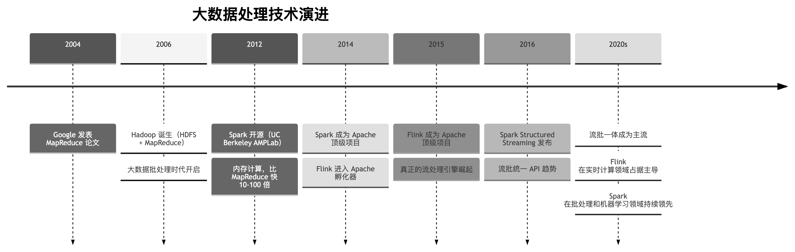
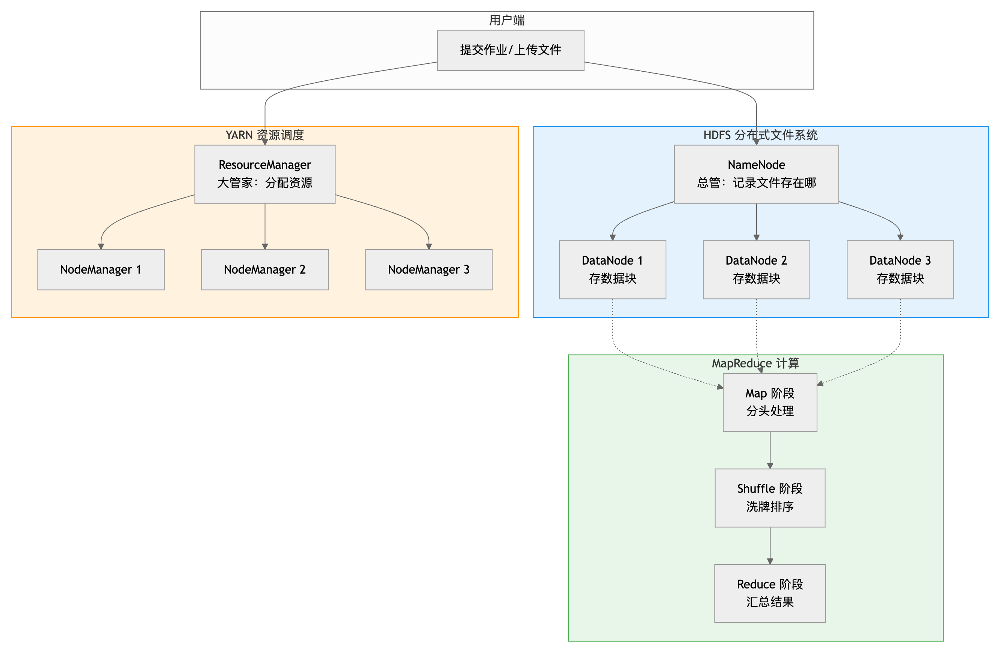
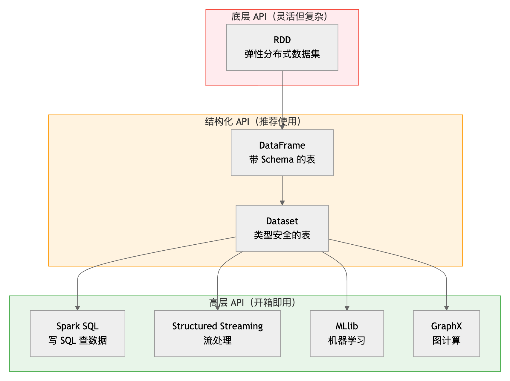
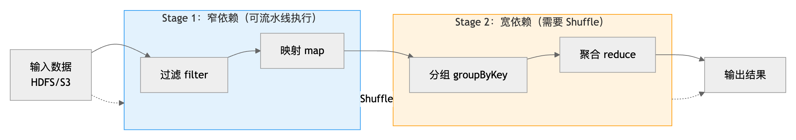
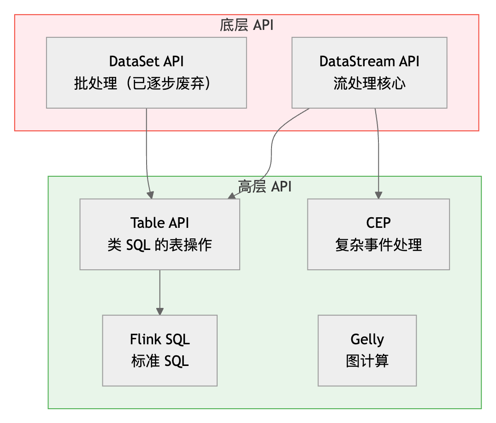
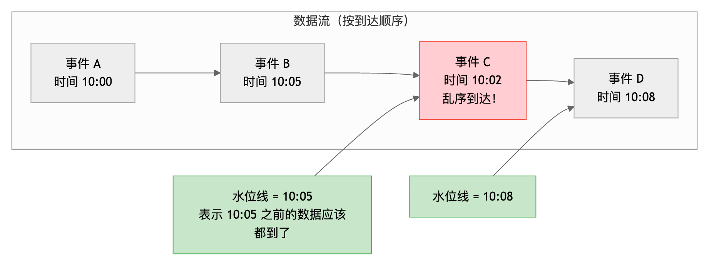
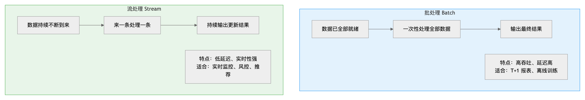

# Spark & Flink 大白话入门指南——从 Hadoop 到流批一体的大数据世界

> 部分内容由豆包生成

> 🎯 **这份文档适合谁？**如果你听说过 Spark、Flink、Hadoop，知道它们和"大数据"有关，但搞不清它们到底解决什么问题、怎么用、原理是什么——那么这份文档就是为你写的。全文用"搬砖""快递""流水线"等生活化比喻，争取让 10 岁孩子也能听懂。

## 开篇：大数据到底难在哪？

### 一个搬山的故事

想象一下：老师让你把一座有 1 亿块砖的山搬到另一个地方。你一个人搬，要搬到什么时候？

这就是"大数据"的核心难题——**数据量太大，一台电脑算不过来**。

一台普通电脑的内存可能只有 16GB，硬盘 1TB。但互联网公司一天产生的数据可能是几十 TB、甚至 PB 级（1PB = 1024TB）。你把这些数据塞进一台电脑，就像让一个人搬一座山——不是不能搬，是搬到天荒地老也搬不完。

### 没有大数据框架时，大家怎么办？

在 Hadoop 出现之前（大约 2006 年以前），面对海量数据，工程师们的选择很有限：

| 方案 | 怎么做 | 问题 |
|---|---|---|
| 升级单机硬件 | 买更贵的服务器，加大内存和硬盘 | 有上限，而且超级贵（纵向扩展） |
| 手写分布式程序 | 自己写代码把数据拆到多台机器上算 | 要处理数据分发、任务调度、机器故障、结果汇总……极其复杂 |
| 商业数据库 | 用 Oracle 等传统数据库的集群版 | 贵到离谱，而且扩展性有限 |

核心痛点是：**分布式计算太复杂了**。你要操心数据怎么拆、任务怎么分、某台机器挂了怎么办、最后结果怎么拼起来——每一个都是大坑。

### 大数据技术演进时间线

下面这张图展示了大数据处理技术的演进脉络：从最早的批处理，到内存计算，再到真正的流处理。



> 💡 **一句话总结：**Hadoop 解决了"能不能用一堆便宜机器算大数据"的问题；Spark 解决了"能不能算得更快"的问题；Flink 解决了"能不能实时算、来一条算一条"的问题。

---

## Hadoop——大数据的开山鼻祖

### 解决了什么问题？

Hadoop 要解决的核心问题是：**如何用一堆便宜的普通电脑（而不是超级计算机），可靠地存储和处理海量数据？**

它的思路很朴素——"人多力量大"：

- **存储**：把一个大文件切成很多小块，分散存在多台机器上（HDFS）
- **计算**：把计算任务也拆成很多小任务，发到存数据的机器上去算（MapReduce）
- **调度**：管理这些机器的资源，谁有空给谁派活（YARN）

就像搬家公司：仓库（HDFS）把货物分散存在多个库房，搬运工（MapReduce）在各自库房附近干活，工头（YARN）负责安排谁干什么。

### 什么语言实现的？

**Hadoop 主要用 Java 实现**，运行在 JVM（Java 虚拟机）上。它的 API 原生支持 Java，也可以通过其他方式用 Python、R 等语言调用。

### 核心三件套



#### HDFS——分布式文件系统

HDFS（Hadoop Distributed File System）解决的是**"大文件怎么存"**的问题。

原理很简单：

1. 把一个 1TB 的大文件切成 128MB 的小块（Block）
2. 每个小块复制 3 份，存在不同的机器上（防止机器坏了数据丢）
3. NameNode 像个账本，记录每个文件的每个块存在哪台机器上
4. DataNode 就是实际存数据的机器

> 📦 **生活化比喻：**HDFS 就像一个连锁仓库系统。NameNode 是总台账，记录"第 3 号货物的 A 部分在 1 号仓、B 部分在 2 号仓"。每个仓库（DataNode）存实际货物，而且每份货物都有 3 个备份，一个仓库着火了也不怕。

#### MapReduce——分布式计算框架

MapReduce 解决的是**"大任务怎么拆开来算"**的问题。它的名字来自两个阶段：

- **Map（映射）**：把大任务拆成很多小任务，每台机器处理自己存的那部分数据。比如统计词频，每台机器先统计自己手里的数据里每个词出现了多少次。
- **Reduce（归约）**：把 Map 阶段的结果汇总起来。比如把各台机器统计的词频加在一起，得到最终结果。

中间还有一个 **Shuffle（洗牌）**阶段，负责把 Map 的输出按 key 分组、排序，送到对应的 Reduce 机器上。

#### YARN——资源调度器

YARN（Yet Another Resource Negotiator）解决的是**"多台机器的 CPU 和内存怎么分配"**的问题。

- **ResourceManager**：大管家，全局管理资源，接收作业请求
- **NodeManager**：每台机器上的小管家，管理本机资源，向大管家汇报

### 典型应用场景

- 海量日志的离线分析（比如统计一个月的用户访问数据）
- 数据仓库建设（把原始数据清洗、加工后存起来）
- 大规模数据的批量 ETL（抽取-转换-加载）
- Web 索引构建（Google 最早就是用 MapReduce 构建搜索索引）

### 代码长什么样？

经典的 WordCount（词频统计）是学习 MapReduce 的"Hello World"。下面是 Java 版本的核心代码：

```java
// Map 阶段：把每行文本拆成单词，输出 (单词, 1)
public static class TokenizerMapper extends Mapper<Object, Text, Text, IntWritable> {
    private final static IntWritable one = new IntWritable(1);
    private Text word = new Text();

    public void map(Object key, Text value, Context context) {
        StringTokenizer itr = new StringTokenizer(value.toString());
        while (itr.hasMoreTokens()) {
            word.set(itr.nextToken());
            context.write(word, one);  // 输出 (hello, 1) (world, 1) ...
        }
    }
}

// Reduce 阶段：把相同单词的计数加起来
public static class IntSumReducer extends Reducer<Text, IntWritable, Text, IntWritable> {
    private IntWritable result = new IntWritable();

    public void reduce(Text key, Iterable<IntWritable> values, Context context) {
        int sum = 0;
        for (IntWritable val : values) {
            sum += val.get();  // 把所有 1 加起来
        }
        result.set(sum);
        context.write(key, result);  // 输出 (hello, 42)
    }
}
```

> 💡 **MapReduce 的痛点：**每一步计算都要把中间结果写到硬盘上，下一个任务再从硬盘读出来。硬盘读写很慢，所以 MapReduce 通常要跑几十分钟甚至几小时。Spark 就是为了解决这个"慢"的问题而生的。

---

## Spark——把计算搬进内存的"飞毛腿"

### 解决了什么问题？

Spark 要解决的核心问题是：**MapReduce 太慢了，能不能把中间数据放在内存里，不用反复读写硬盘？**

MapReduce 的每个阶段都要落盘（写硬盘），而 Spark 把中间数据尽量放在内存中，所以速度可以快 **10 到 100 倍**。尤其是迭代式计算（比如机器学习算法要反复跑很多轮），Spark 的优势更加明显。

> ⚡ **生活化比喻：**MapReduce 像做一道菜，切完菜把菜放冰箱，炒的时候再从冰箱拿出来，炒完又放冰箱，每一步都要开关冰箱。Spark 像在灶台边一气呵成，切完直接炒，炒完直接装盘，中间不反复放冰箱。

### 什么语言实现的？

**Spark 核心用 Scala 实现**（Scala 也是运行在 JVM 上的语言）。但它的 API 支持多种语言：

| 语言 | 支持程度 | 适合人群 |
|---|---|---|
| Scala | 原生，最完整 | 追求性能和函数式编程的开发者 |
| Java | 完整 | Java 后端开发者 |
| Python（PySpark） | 完整，最流行 | 数据分析师、算法工程师 |
| SQL | 完整（Spark SQL） | 数据分析师，不用写代码 |
| R | 较完整 | 统计学家 |

### API 家族一览

Spark 提供了多层 API，从底层到上层越来越简单：



- **RDD（Resilient Distributed Dataset）**：最底层的抽象，就是一个"分布式的、可容错的、不可变的数据集合"。灵活但需要手动优化，现在一般只在特殊场景用。
- **DataFrame**：像数据库里的表，有列名和类型（Schema）。可以做过滤、分组、Join 等操作，底层会自动优化。
- **Dataset**：DataFrame 的增强版，在编译时就能检查类型错误（只有 Scala/Java 支持）。
- **Spark SQL**：直接写 SQL 语句查询分布式数据，对数据分析师最友好。
- **Structured Streaming**：用批处理的 API 写流处理程序，把无限数据流当成一张"不断增长的表"来处理。
- **MLlib**：内置的机器学习库，支持分类、回归、聚类、推荐等算法。
- **GraphX**：图计算库，适合处理社交网络、网页排名等图结构数据。

### 代码长什么样？

下面用 PySpark（Python API）演示一个完整的数据分析流程：

```python
from pyspark.sql import SparkSession
from pyspark.sql.functions import col, avg, count

# 1. 创建 SparkSession（Spark 的入口）
spark = SparkSession.builder \
    .appName("UserAnalysis") \
    .master("local[*]") \
    .getOrCreate()

# 2. 读取数据（支持 CSV、JSON、Parquet、数据库等）
df = spark.read.csv("users.csv", header=True, inferSchema=True)

# 3. 数据处理：像写 SQL 一样链式调用
result = (df
    .filter(col("age") >= 18)              # 只看成年人
    .groupBy("city")                        # 按城市分组
    .agg(
        count("*").alias("user_count"),     # 统计每个城市的用户数
        avg("age").alias("avg_age")         # 统计平均年龄
    )
    .orderBy(col("user_count").desc())      # 按用户数降序排列
)

# 4. 触发计算并展示结果（之前的步骤都是"懒执行"，到这才真正跑）
result.show()

# 5. 也可以直接写 SQL
df.createOrReplaceTempView("users")
spark.sql("""
    SELECT city, COUNT(*) as cnt, AVG(age) as avg_age
    FROM users
    WHERE age >= 18
    GROUP BY city
    ORDER BY cnt DESC
""").show()

spark.stop()
```

> 🔑 **关键概念——懒执行（Lazy Evaluation）：**Spark 不会你写一行就执行一行，而是先把所有操作记下来（形成一个"执行计划"），等到真正需要输出结果时（比如 `show()`、`write()`）才一起执行。这样它可以在执行前优化整个计划，比如把过滤提前、合并重复操作。

### 核心原理

#### RDD——Spark 的灵魂

RDD（弹性分布式数据集）是 Spark 最核心的抽象。理解了 RDD，就理解了 Spark 的一半。

RDD 的四个关键词：

- **分布式（Distributed）**：数据被拆成很多分区（Partition），分散在多台机器上。
- **弹性（Resilient）**：如果某个分区的数据丢了或算错了，可以根据"血缘关系"（Lineage）重新算出来，不需要存备份。
- **数据集（Dataset）**：就是一堆数据的集合。
- **不可变（Immutable）**：RDD 一旦创建就不能改，每次操作都生成新的 RDD。

#### DAG 执行引擎

Spark 把计算过程组织成一个 **DAG（有向无环图）**，然后根据"宽窄依赖"把 DAG 切成多个 Stage（阶段），每个 Stage 里的任务可以并行执行。



**宽窄依赖是什么？**

- **窄依赖**：父 RDD 的每个分区只被子 RDD 的一个分区使用。比如 map、filter，一条数据进来变成一条数据出去，不需要和其他机器交换数据，可以在一台机器上连续执行。
- **宽依赖**：父 RDD 的分区被多个子 RDD 分区使用。比如 groupByKey、join，需要把相同 key 的数据从不同机器汇总到一起，这个过程叫 **Shuffle（洗牌）**，是 Spark 中最耗时的操作。

> 🎯 **优化的核心：**减少 Shuffle！因为 Shuffle 要在网络上传输大量数据，非常慢。常见优化手段：提前过滤数据、用 reduceByKey 代替 groupByKey、合理设置分区数、数据倾斜处理。

#### 内存计算

Spark 把中间数据尽量存在内存中，只有内存不够时才溢写到硬盘。这是它比 MapReduce 快的根本原因。

Spark 的内存分为两部分：

- **执行内存**：用来做 Shuffle、排序、聚合等计算
- **存储内存**：用来缓存经常访问的数据（`cache()` / `persist()`）

### 典型应用场景

- **批处理 ETL**：海量数据的清洗、转换、加载，比 MapReduce 快很多
- **交互式查询**：用 Spark SQL 对大数据做即席查询，秒级响应
- **机器学习**：MLlib 提供分布式机器学习算法，迭代计算优势明显
- **图计算**：社交网络分析、网页排名等
- **近实时流处理**：Structured Streaming 可以做分钟级甚至秒级的流处理（但不是真正的逐条处理）

---

## Flink——为"实时"而生的流处理大师

### 解决了什么问题？

Flink 要解决的核心问题是：**能不能做到"来一条数据，立刻处理一条"，而不是攒一批再处理？并且保证结果绝对正确、不丢不重？**

Spark Streaming（包括 Structured Streaming）本质上是"微批处理"——把数据流切成很小的批次（比如每 100ms 一批），然后按批处理。而 Flink 是**真正的逐条流处理**，延迟可以做到毫秒级。

> 🚚 **生活化比喻：**Spark Streaming 像快递驿站，每隔 10 分钟把攒下的包裹集中分拣一次。Flink 像快递员上门取件，来一个包裹立刻分拣送走，不用等。

### 什么语言实现的？

**Flink 核心用 Java 和 Scala 实现**，运行在 JVM 上。API 支持：

| 语言 | 支持程度 |
|---|---|
| Java | 原生，最完整 |
| Scala | 原生，最完整 |
| Python（PyFlink） | 较完整，持续完善中 |
| SQL | 完整（Table API & SQL） |

### API 家族一览



- **DataStream API**：Flink 流处理的核心，用来处理无限数据流。支持 map、filter、keyBy、window、aggregate 等操作。
- **DataSet API**：Flink 的批处理 API，但 Flink 社区正在推进"流批一体"，批处理也可以用 DataStream API 实现，DataSet API 已逐步废弃。
- **Table API & SQL**：结构化数据处理，可以写 SQL 或类 SQL 的 Table API，同时支持流和批。
- **CEP（Complex Event Processing）**：复杂事件处理，用来在流中匹配特定的事件模式（比如"用户 1 分钟内连续登录失败 3 次"）。

### 代码长什么样？

下面用 Java API 演示一个实时词频统计的流处理程序：

```java
import org.apache.flink.streaming.api.datastream.DataStream;
import org.apache.flink.streaming.api.environment.StreamExecutionEnvironment;
import org.apache.flink.api.common.functions.FlatMapFunction;
import org.apache.flink.api.java.tuple.Tuple2;
import org.apache.flink.util.Collector;

// 1. 获取流执行环境
StreamExecutionEnvironment env = StreamExecutionEnvironment.getExecutionEnvironment();

// 2. 接入数据源（这里用 Socket 模拟实时数据流）
DataStream<String> text = env.socketTextStream("localhost", 9999);

// 3. 处理数据流
DataStream<Tuple2<String, Integer>> wordCounts = text
    .flatMap(new FlatMapFunction<String, Tuple2<String, Integer>>() {
        @Override
        public void flatMap(String line, Collector<Tuple2<String, Integer>> out) {
            for (String word : line.split(" ")) {
                out.collect(new Tuple2<>(word, 1));  // 拆成 (单词, 1)
            }
        }
    })
    .keyBy(0)          // 按单词分组（第 0 个字段）
    .sum(1);           // 对第 1 个字段求和（实时累加）

// 4. 输出结果
wordCounts.print();

// 5. 启动执行（Flink 也是懒执行，必须调用 execute 才会跑）
env.execute("Streaming WordCount");
```

再看一个用 Flink SQL 做实时统计的例子，更简洁：

```sql
-- 定义一张"不断增长"的源表，数据来自 Kafka
CREATE TABLE orders (
    order_id BIGINT,
    user_id BIGINT,
    amount DECIMAL(10, 2),
    order_time TIMESTAMP(3),
    WATERMARK FOR order_time AS order_time - INTERVAL '5' SECOND
) WITH (
    'connector' = 'kafka',
    'topic' = 'orders',
    'properties.bootstrap.servers' = 'localhost:9092',
    'format' = 'json'
);

-- 定义结果表，写入 Redis/MySQL
CREATE TABLE hourly_sales (
    window_start TIMESTAMP(3),
    window_end TIMESTAMP(3),
    total_amount DECIMAL(10, 2)
) WITH (
    'connector' = 'jdbc',
    'url' = 'jdbc:mysql://localhost:3306/db',
    'table-name' = 'hourly_sales'
);

-- 实时统计每小时的销售额，来一条算一条
INSERT INTO hourly_sales
SELECT
    TUMBLE_START(order_time, INTERVAL '1' HOUR) as window_start,
    TUMBLE_END(order_time, INTERVAL '1' HOUR) as window_end,
    SUM(amount) as total_amount
FROM orders
GROUP BY TUMBLE(order_time, INTERVAL '1' HOUR);
```

### 核心原理

#### 事件时间 vs 处理时间

Flink 支持三种时间语义，这是它能正确处理乱序数据的关键：

| 时间语义 | 含义 | 比喻 |
|---|---|---|
| 事件时间（Event Time） | 事件实际发生的时间（数据里自带的时间戳） | 快递的"发货时间" |
| 摄入时间（Ingestion Time） | 数据进入 Flink 的时间 | 快递的"入库时间" |
| 处理时间（Processing Time） | 算子实际处理这条数据的时间 | 快递的"分拣时间" |

**为什么事件时间很重要？**因为网络延迟、消息队列积压等原因，数据可能会乱序到达——先发生的事件后到。如果用处理时间，就会把数据算到错误的时间窗口里。Flink 用事件时间 + 水位线来解决这个问题。

#### 水位线（Watermark）

水位线是 Flink 中最核心也最难理解的概念之一。



**水位线的本质：**它是一个"时间戳"，表示"这个时间之前的事件应该都已经到了，如果还有比这个时间更早的事件来，那就是迟到数据"。

当水位线超过窗口的结束时间时，Flink 就认为这个窗口可以关闭并计算结果了。比如 10:00-10:10 的窗口，当水位线到 10:10 时，窗口触发计算。

水位线通常设置为"当前最大事件时间 - 允许的乱序时间"，比如允许 5 秒乱序，那水位线就是最大事件时间减 5 秒。

#### 窗口（Window）

流是无限的，但计算需要有边界。窗口就是把无限流切成有限的"桶"来计算。

- **滚动窗口（Tumbling）**：窗口不重叠，比如每 1 小时统计一次。
- **滑动窗口（Sliding）**：窗口可以重叠，比如每 5 分钟统计过去 1 小时的数据。
- **会话窗口（Session）**：按活动间隙切分，比如用户连续操作算一个会话，超过 30 分钟没操作就断开。

#### 状态管理与检查点（Checkpoint）

流处理程序是 7×24 小时运行的，中间可能挂掉。Flink 用**状态（State）**保存中间计算结果，用**检查点（Checkpoint）**定期把状态快照存到持久化存储（比如 HDFS/S3）。

挂掉之后，Flink 可以从最近的检查点恢复，并且保证**精确一次（Exactly-Once）**语义——每条数据对最终结果的影响恰好一次，不丢也不重。

> 💡 **精确一次（Exactly-Once）是怎么做到的？**Flink 使用了一种叫"Chandy-Lamport 算法"的分布式快照技术，在数据流中插入"屏障"（Barrier），当所有算子都收到同一个屏障时，就做一次状态快照。恢复时从快照恢复，屏障之后的数据重新处理，屏障之前的数据不重复处理。

#### 反压（Backpressure）

如果下游算子处理不过来（比如写数据库太慢），Flink 会自动把压力往上传导，让上游放慢速度，就像水管里的水堵住了会往回流一样。这保证了系统不会因为某个环节慢而崩溃。

### 典型应用场景

- **实时数仓**：实时 ETL、实时指标计算，数据进来秒级就能查到
- **实时推荐**：根据用户实时行为立刻调整推荐内容
- **风控反欺诈**：实时检测异常交易，毫秒级响应拦截
- **监控告警**：实时分析日志和指标，异常立刻告警
- **物联网（IoT）**：处理传感器实时数据流
- **实时报表/大屏**：销售额、在线人数等指标实时刷新

---

## Spark vs Flink——到底怎么选？

### 核心差异对比

| 维度 | Spark | Flink |
|---|---|---|
| 设计哲学 | 批处理为核心，流是"微批" | 流处理为核心，批是"有界流" |
| 处理模型 | 微批处理（Mini-batch） | 逐条处理（Native Streaming） |
| 延迟 | 秒级（最低约 100ms） | 毫秒级 |
| 吞吐量 | 高 | 非常高 |
| 批处理能力 | 极强（生态最成熟） | 强（流批一体后持续增强） |
| 流处理能力 | 中等（Structured Streaming） | 极强（原生流处理） |
| 状态管理 | 较弱（流处理场景） | 极强（内置状态后端） |
| 事件时间支持 | 有，但不如 Flink 完善 | 原生支持，水位线机制成熟 |
| SQL 支持 | 非常成熟（Spark SQL） | 成熟（Flink SQL，快速发展） |
| 机器学习 | MLlib 生态丰富 | 较弱（FlinkML 发展中） |
| 图计算 | GraphX | Gelly（已不活跃） |
| 实现语言 | Scala | Java + Scala |
| 社区活跃度 | 非常高 | 高（实时领域主导） |

### 批处理 vs 流处理的本质



### 选型建议

> ✅ **选 Spark 的场景：**
>
> - 主要做离线批处理、数据仓库 ETL
> - 需要机器学习（MLlib 生态成熟）
> - 团队已经熟悉 Spark，流处理需求不高（分钟级延迟可接受）
> - 需要交互式查询（Spark SQL + Thrift Server）

> ✅ **选 Flink 的场景：**
>
> - 核心需求是实时计算（毫秒/秒级延迟）
> - 需要精确一次语义、复杂的事件时间处理
> - 实时数仓、实时风控、实时推荐等场景
> - 需要复杂事件处理（CEP）

> 🤝 **很多公司两者都用：**离线批处理用 Spark，实时流处理用 Flink，数据在两者之间流转。这是目前最常见的架构模式。

---

## 学习路径建议

### 第一阶段：打基础（1-2 周）

1. 理解分布式系统基本概念：分区、副本、容错、一致性
2. 理解 Hadoop 的 HDFS 和 MapReduce 原理（不用深入写代码，理解思想即可）
3. 搭一个本地伪分布式环境，跑通 WordCount

### 第二阶段：主攻 Spark（2-3 周）

1. 学习 RDD 的核心概念和常用算子（map、flatMap、filter、reduceByKey、join）
2. 重点学习 DataFrame/Dataset API 和 Spark SQL（实际工作中最常用）
3. 理解 DAG、Stage、宽窄依赖、Shuffle
4. 做一个实战项目：比如分析一份公开数据集（电商日志、电影评分等）
5. 了解 Spark 调优：内存配置、分区数、数据倾斜、广播变量

### 第三阶段：主攻 Flink（2-3 周）

1. 学习 DataStream API：source、transform、sink
2. 重点理解时间语义、水位线、窗口
3. 理解状态管理和检查点机制
4. 学习 Flink SQL（现在企业里用得越来越多）
5. 做一个实战项目：比如实时统计 Kafka 中的数据，写入 MySQL/Redis

### 第四阶段：深入与实战（持续）

1. 研究源码：Spark 的 DAGScheduler、Flink 的 JobManager/TaskManager
2. 学习性能调优和故障排查
3. 了解流批一体架构、数据湖（Iceberg/Hudi/Delta Lake）
4. 参与开源社区或在工作中实际使用

### 推荐学习资源

- **官方文档**：Spark 官方文档（spark.apache.org）、Flink 官方文档（flink.apache.org）——最权威、最及时
- **书籍**：《Spark 快速大数据分析》《Flink 基础教程》《Streaming Systems》
- **在线课程**：各平台的大数据实战课程，选有实战项目的
- **源码**：GitHub 上阅读 Spark 和 Flink 源码，配合技术博客

---

> 🎉 **最后一句话：**不要试图一次学完所有东西。先跑通一个 Hello World，再做一个小项目，在实战中遇到问题再去深入原理。大数据框架的核心思想其实很朴素——"分而治之"，剩下的都是工程细节。祝你学习顺利！
