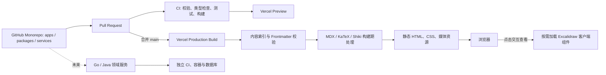

# story-web 技术方案（V1）

> 状态：Monorepo 与 Web 工程骨架已初始化，待进入内容系统与页面实现  
> 更新日期：2026-08-04

## 1. 项目概述

story-web 是一个以个人简历、文章和作品为核心的个人网站，同时采用可渐进扩展的 Monorepo 组织形式。网站采用黑白极简视觉风格：首页直接呈现个人简历，并通过克制的开屏动画建立第一印象；一级导航暂定为「首页」「文章」「作品」。

V1 使用 GitHub 作为代码和内容的唯一事实来源，正文由 Markdown/MDX 承载，画板以 Excalidraw 源文件及服务端静态摘要作为正文附件。访客站位于 `apps/web`，在构建期完成内容解析和页面生成并通过 Vercel 发布；未来可以在 `apps/` 增加管理端，在 `services/` 增加 Go、Java 等独立后端，而不破坏现有 Web 边界。V1 本身不引入数据库、CMS 或运行时 GitHub API。

## 2. 目标与非目标

### 2.1 V1 目标

- 首页展示个人简介、经历、技能、教育背景、联系方式等简历内容。
- 提供文章列表、文章详情、作品列表和作品详情。
- 完整支持常用 Markdown 语法，并支持代码高亮、表格、任务列表、脚注和数学公式。
- 在文章和作品中嵌入 Excalidraw 画板，默认快速预览，需要时再进入交互查看。
- 所有内容均可通过 Git 提交、Pull Request 和 Review 管理。
- 页面默认静态生成，兼顾 SEO、首屏性能和后续迁移能力。
- 使用 Vercel Preview 审阅分支内容，合并到 `main` 后自动发布生产环境。
- 满足响应式、键盘操作、减少动态效果偏好等基础无障碍要求。

### 2.2 V1 非目标

- 不开发站内 Markdown 编辑器或飞书式多人协同编辑器。
- 不提供登录、评论、点赞、收藏、后台管理和全文检索服务。
- 不在浏览器运行时请求 GitHub Raw、GitHub API 或第三方 CMS。
- 不实现 Excalidraw 在线多人协作或在网站内保存画板修改。
- 暂不针对中国大陆网络环境单独部署；仅保留可迁移的工程边界。

## 3. 核心技术决策

| 决策       | V1 选择                                           | 原因                                                            |
| ---------- | ------------------------------------------------- | --------------------------------------------------------------- |
| 仓库形态   | pnpm Workspace + Turborepo Monorepo               | 统一前端任务和依赖图，同时为未来多应用留出清晰边界              |
| Web 框架   | Next.js App Router + TypeScript                   | 支持 Server Components、静态预渲染、路由级 Metadata，适合内容站 |
| 样式       | Tailwind CSS + CSS Variables + Typography         | 快速形成一致的黑白视觉，同时保留少量设计令牌                    |
| 内容格式   | Markdown/MDX                                      | 兼容现有 Markdown 文档，并允许按需嵌入受控 React 组件           |
| 内容存储   | 与站点代码同一个 GitHub 仓库                      | 版本、Review、预览与发布链路最简单                              |
| 内容生成   | 构建期扫描、校验并静态生成                        | 无运行时内容依赖，SEO 和可迁移性更好                            |
| 自由画板   | Excalidraw 源文件 + HTML 静态摘要                 | 开放格式、Git 可管理、React 可嵌入，不改变 Markdown 真源        |
| 动效       | CSS 为主，Motion for React 按需使用               | 控制客户端 JavaScript，只为复杂编排引入动画运行时               |
| 部署       | GitHub + Vercel                                   | PR 自动预览，`main` 自动生产部署，当前维护成本低                |
| 服务端状态 | 无数据库、无 CMS、无 Vercel 专属存储              | V1 不需要，并为未来国内迁移保留选择                             |
| 后端扩展   | `services/<domain-service>` + 原生 Go/Java 工具链 | 服务可独立构建和部署，不让 Node 工具链侵入后端工程              |

关键原则：**GitHub 中的内容文件是唯一真源，构建产物是可随时重建的派生结果。**

### 3.1 Monorepo 边界

- `apps/`：可独立运行和部署的前端或 Node.js 应用。当前只有 `apps/web`，管理后台出现真实需求后再创建 `apps/admin`。
- `packages/`：多个 JavaScript/TypeScript 消费者真正需要共享的库。V1 不提前创建空的 UI、配置或工具包。
- `services/`：未来独立运行的 Go、Java API 或 worker，目录按业务职责命名，例如 `services/content-api`，而不是按语言命名。
- `contracts/`：未来需要跨语言共享时再创建，保存 OpenAPI、JSON Schema 或 Protobuf 等契约真源。

依赖方向必须保持单向：`apps → packages`。应用之间不能直接 import；后端服务之间以及前后端之间通过明确的 HTTP/RPC/事件契约通信，不能跨目录引用源码。

pnpm 与 Turborepo 只管理 JavaScript/TypeScript workspace。Go/Java 服务分别使用 `go`、Gradle 或 Maven 构建，由仓库级 CI 按路径协调，不用虚假的 `package.json` 包装原生工程。

## 4. 信息架构与路由

| 路由               | 页面内容                                   | 渲染方式                   |
| ------------------ | ------------------------------------------ | -------------------------- |
| `/`                | 开屏、个人简介、经历、技能、教育、联系方式 | 静态生成；开屏为客户端增强 |
| `/articles`        | 已发布文章列表、标签和摘要                 | 静态生成                   |
| `/articles/[slug]` | 文章详情、目录、上一篇/下一篇              | 按内容清单静态生成         |
| `/works`           | 作品列表、类型、时间和状态                 | 静态生成                   |
| `/works/[slug]`    | 作品背景、过程、成果、链接和画板           | 按内容清单静态生成         |
| `/rss.xml`         | 已发布文章 RSS                             | 构建期生成                 |
| `/sitemap.xml`     | 首页、文章、作品 URL                       | 构建期生成                 |
| `/robots.txt`      | 爬虫规则                                   | 静态或构建期生成           |
| 其他不存在的路径   | `not-found.tsx` 提供的 404 页面            | 静态生成                   |

V1 不单独设置「简历」Tab，简历即首页主体。若未来首页内容明显变重，可再增加 `/about` 或 `/resume`，不影响现有内容路由。

## 5. 总体架构



### 5.1 Server/Client 边界

默认使用 Server Components。只有依赖浏览器状态或交互的组件才声明为 Client Component：

- `IntroOverlay`：开屏动画、跳过按钮和 `sessionStorage` 状态。
- `MobileNavigation`：移动端菜单交互。
- `WhiteboardViewer`：Excalidraw 动态加载、缩放和全屏查看。
- 未来可能增加的筛选、搜索等局部交互。

文章正文、作品详情、目录、卡片列表、Metadata 和结构化数据均在服务端或构建期完成，避免把整页变成客户端应用。

## 6. 技术栈

### 6.1 基础工程

- Next.js App Router
- React
- TypeScript，开启严格模式
- pnpm Workspace + 单一根 lockfile
- Turborepo：调度并缓存 JS/TS 工作区任务
- ESLint + Prettier
- Node.js 22.18+，pnpm 版本通过 `packageManager` 与 Corepack 固定

不在方案文档中长期写死依赖小版本；以 `package.json` 和 `pnpm-lock.yaml` 为实际版本依据，依赖升级通过独立 PR 完成。

### 6.2 UI 与视觉

- Tailwind CSS：布局、响应式和常用视觉样式。
- `@tailwindcss/typography`：提供文章排版基线，再通过 CSS Variables 覆盖为项目风格。
- CSS Variables：维护颜色、间距、边框、字体和动效时长等少量令牌。
- `next/font`：字体文件随站点自托管，浏览器不依赖 Google Fonts 或第三方字体 CDN。
- Motion for React：只用于开屏和确实需要时间线编排的过渡；普通 hover、淡入和位移优先使用 CSS。

建议的视觉令牌保持克制：

```css
:root {
  --background: #f7f7f5;
  --foreground: #111111;
  --muted: #6f6f6b;
  --line: #d8d8d2;
  --surface: #ffffff;
  --selection: #111111;
}
```

是否提供手动深浅色切换不影响底层方案。V1 可以先跟随系统偏好，所有组件均只消费语义化变量，不直接散落硬编码颜色。

### 6.3 Markdown/MDX

使用 Next.js 官方 `@next/mdx` 管线处理 `.md` 和 `.mdx`：

- 普通 Markdown 文档可直接迁入，不要求重写正文。
- 需要画板、提示块等交互内容时改用 `.mdx`，仅使用项目登记过的组件。
- `remark-frontmatter`：识别 YAML Frontmatter。
- `remark-gfm`：表格、任务列表、删除线、自动链接和脚注。
- `remark-math` + `rehype-katex`：数学公式。
- `rehype-slug`：为标题生成稳定锚点。
- `rehype-autolink-headings`：标题链接。
- Shiki/对应 rehype 插件：在构建期完成代码高亮。
- Mermaid 不在 V1 默认依赖中；出现真实内容需求后，再优先采用构建期安全渲染。

不采用已归档的 `next-mdx-remote`。内容文件位于本仓库时，官方 MDX 编译能力加一层很薄的本地内容索引即可满足需求，也避免运行时求值和额外 CSP 约束。

### 6.4 内容索引与校验

建立 `apps/web/scripts/generate-content-index.mjs`：

1. 扫描 `apps/web/content/articles` 和 `apps/web/content/works`。
2. 读取 Frontmatter，使用 Zod 校验字段。
3. 从文件名或目录名派生 `slug`，不在 Frontmatter 中重复维护。
4. 检查重复 slug、无效日期、缺失资源、失效内部链接和非法草稿状态。
5. 生成带静态 import 的内容清单，供列表页、`generateStaticParams`、RSS 和 sitemap 复用。
6. 在 `dev` 和 `build` 前自动执行；生成文件禁止人工修改。

这样既保留官方 MDX 的构建方式，又能让动态路由完整静态生成。

### 6.5 画板

使用 `@excalidraw/excalidraw`，但不把完整编辑器打进文章首屏包：

- `.excalidraw` JSON 是可编辑源文件。
- `<Whiteboard>` 默认在服务端读取画板文本节点并渲染可访问的 HTML 静态摘要，不下载编辑器资源。
- 有真实视觉预览需求时，可以额外提交导出的 `.svg` 或 `.png`，但不把来源不可信的 SVG 直接内联。
- 点击「交互查看」后，使用 dynamic import 加载 Client Component。
- 交互模式默认只读，允许缩放、平移和全屏，不向服务器保存修改。
- Excalidraw 版本通过 lockfile 固定，升级时重新验证源文件兼容性。
- 禁止在画板 JSON 中长期内嵌大体积 base64 图片；图片独立保存到 `apps/web/public/media`。
- 不直接内联来源不可信的 SVG。

### 6.6 暂不采用的方案

- [飞书云文档组件](https://open.feishu.cn/document/client-docs/intro?lang=zh-CN)：能够嵌入飞书文档，但依赖飞书 SaaS、账号和权限体系，不符合 GitHub 作为内容真源的目标。
- [ByteMD](https://github.com/pd4d10/bytemd)：适合做浏览器内 Markdown 编辑器，但 V1 只需要构建期渲染，而且它不提供自由画板。
- [BlockSuite](https://github.com/toeverything/blocksuite)：最接近文档与无限画板共用数据模型的体验，但内容真源是块结构/Yjs Snapshot，不是 Markdown，作为个人只读站点过重。
- [`next-mdx-remote`](https://github.com/hashicorp/next-mdx-remote)：上游已归档，且远程字符串编译不是本项目所需；改用 Next.js 官方 MDX 管线。
- [tldraw](https://github.com/tldraw/tldraw/blob/main/LICENSE.md)：画板能力完整，但当前生产许可不如 Excalidraw 的 MIT 许可适合本项目。

## 7. 建议目录结构

```text
story-web/
├── apps/
│   └── web/
│       ├── mdx-components.tsx
│       ├── src/
│       │   ├── app/
│       │   │   ├── (site)/
│       │   │   │   ├── page.tsx
│       │   │   │   ├── articles/
│       │   │   │   └── works/
│       │   │   ├── layout.tsx
│       │   │   ├── not-found.tsx
│       │   │   ├── robots.ts
│       │   │   ├── rss.xml/route.ts
│       │   │   ├── sitemap.ts
│       │   │   └── globals.css
│       │   ├── components/
│       │   │   ├── content/
│       │   │   ├── home/
│       │   │   ├── layout/
│       │   │   └── ui/
│       │   └── lib/
│       │       ├── content/
│       │       ├── seo/
│       │       └── utils/
│       ├── content/
│       │   ├── articles/example.mdx
│       │   ├── works/example.mdx
│       │   └── resume.ts
│       ├── public/
│       │   ├── boards/
│       │   ├── media/
│       │   └── fonts/
│       ├── scripts/
│       │   ├── generate-content-index.mjs
│       │   └── export-boards.mjs
│       └── package.json
├── packages/
│   └── README.md
├── services/
│   └── README.md
├── docs/
├── .github/workflows/
├── package.json
├── pnpm-lock.yaml
├── pnpm-workspace.yaml
└── turbo.json
```

`apps/web/content/resume.ts` 采用类型化数据，而不是把简历写死在页面组件中，便于以后导出 PDF、增加英文版或复用到结构化数据。

## 8. 内容模型

### 8.1 文章

文件路径决定 URL，例如 `apps/web/content/articles/building-story-web.mdx` 对应 `/articles/building-story-web`。

```yaml
---
title: 建立我的个人网站
summary: 从内容模型到视觉系统的设计记录。
publishedAt: 2026-08-04
updatedAt: 2026-08-04
tags:
  - Next.js
  - 设计
draft: false
featured: true
cover: /media/articles/building-story-web/cover.webp
---
```

字段约束：

- `title`、`summary`、`publishedAt`、`draft` 必填。
- `publishedAt`、`updatedAt` 使用 `YYYY-MM-DD` 表示自然日期；如果改用完整时间，必须带时区偏移。
- `tags` 统一大小写和展示名称，避免同义标签重复。
- `draft: true` 的内容不进入列表、RSS、sitemap 和生产详情页。
- 同日期内容以 slug 作为稳定的第二排序键，确保构建结果一致。

### 8.2 作品

```yaml
---
title: Story Web
summary: 一个用于记录简历、文章与作品的个人网站。
publishedAt: 2026-08-04
updatedAt: 2026-08-04
status: building
role: 设计与开发
stack:
  - Next.js
  - TypeScript
  - Tailwind CSS
repoUrl: https://github.com/songxiaopeng529/story-web
demoUrl: null
draft: false
featured: true
cover: /media/works/story-web/cover.webp
---
```

`status` 使用固定枚举，例如 `concept`、`building`、`shipped`、`archived`。所有外部 URL 在构建期检查协议，前端统一增加安全的外链属性。

### 8.3 MDX 受控组件

第一批只提供少量稳定组件：

- `<Whiteboard />`：Excalidraw 服务端静态摘要与交互查看。
- `<Callout />`：提示、说明和警告。
- `<Figure />`：带标题、尺寸信息和替代文本的图片。
- `<Video />`：本地或允许域名的视频。

示例：

```mdx
<Whiteboard
  src="/boards/story-web.excalidraw"
  preview="/boards/story-web.svg"
  title="Story Web 信息架构"
/>
```

不要允许文章任意 import React 组件；所有可用组件集中在 `apps/web/mdx-components.tsx` 注册，便于满足 Next.js 文件约定，同时控制兼容性和客户端体积。

## 9. 首页与动效设计

### 9.1 首页结构

1. 开屏动画与姓名/定位。
2. 简短自我介绍。
3. 工作经历时间线。
4. 精选作品。
5. 精选文章。
6. 技能、教育和联系方式。

开屏只负责情绪表达，不能成为访问正文的前置阻塞。实现要求：

- 首次进入当前浏览器会话时播放；同一会话后续导航不重复播放。
- 提供「跳过」操作，键盘可聚焦。
- 尊重 `prefers-reduced-motion`，此时直接展示最终状态或只做极短淡入。
- 动画期间正文仍存在于 HTML 中，不能损害 SEO 或无脚本访问。
- 不用开屏动画掩盖数据加载；V1 页面本身应已静态生成。

### 9.2 响应式与无障碍

- 从移动端开始设计，正文保持舒适行宽。
- 交互控件提供清晰 focus 状态，不能只依赖 hover。
- 黑白配色仍需满足文本对比度，弱化信息不使用过浅灰色。
- 图像、画板和视频提供替代文本或文字摘要。
- 正确使用标题层级、地标元素和跳至正文链接。
- 触控设备不依赖精细鼠标操作；画板全屏模式提供明确退出按钮。

## 10. SEO、分享与内容发现

- 根布局设置 `metadataBase`、标题模板、站点描述和 canonical 基础信息。
- 文章详情使用 `generateMetadata` 生成 title、description、Open Graph 和 Twitter Card。
- 输出 Person、Article、CreativeWork 等 JSON-LD，字段仅来自已校验内容。
- 生成 `sitemap.xml`、`robots.txt`、RSS 和 404 页面。
- 草稿和未发布内容不能进入 sitemap、RSS 或生产构建。
- 文章标题生成稳定锚点与目录；内部链接使用 Next.js `Link`。
- 社交分享图优先使用静态模板或构建期生成，避免运行时依赖。

## 11. 性能策略

- 内容页面默认静态生成，不在请求时读取 GitHub。
- Server Components 为默认边界，减少客户端 JavaScript。
- Shiki、KaTeX 和内容索引均放在构建期处理。
- Excalidraw 必须拆分成独立 chunk，未点击时不下载编辑器代码。
- 图片提供明确宽高，优先 WebP/AVIF，避免布局偏移。
- 字体自托管并限制字重；中文字体优先使用可靠的系统字体栈，避免下载超大字库。
- 第三方统计、评论和嵌入脚本默认不进入 V1。
- CI 或发布前通过 Lighthouse 检查首页、文章页、作品页三个模板。

性能验收以真实页面测量为准，不为了追求动画效果牺牲正文可见时间。

## 12. 安全与内容信任边界

- MDX 可以执行 JSX，因此仅编译本仓库内经过 Review 的可信内容。
- V1 不接受用户输入、远程 URL 或外部投稿直接进入 MDX 编译器。
- 如果未来开放投稿，投稿格式改为纯 Markdown，禁用 raw HTML，并在独立管线中做 HTML 清洗。
- 外链统一使用 `rel="noopener noreferrer"`。
- 未来若加入 Mermaid，使用严格安全配置并优先输出静态图。
- 不内联来源不可信的 SVG；上传型资源需要内容类型与大小校验。
- 仓库不保存 Vercel Token、分析密钥或其他凭据；环境变量只配置在部署平台。

## 13. 测试与质量门禁

### 13.1 测试层级

- Vitest：内容 schema、排序、slug、日期、URL、RSS 等纯函数。
- React Testing Library：同步 UI 和少量 Client Component 行为。
- Playwright：首页可访问、导航、文章详情、作品详情、404、开屏跳过和画板懒加载。
- `next build`：作为静态生成和 MDX 编译的最终集成检查。

异步 Server Components 主要通过 Playwright 和完整构建覆盖，不强行用单元测试模拟整个 Next.js 运行时。

### 13.2 Pull Request 门禁

每个 PR 至少执行：

```text
content:check
lint
typecheck
test
build
```

内容检查覆盖：重复 slug、无效 Frontmatter、草稿泄漏、内部断链、缺失媒体与缺失画板源文件。

当前 `.github/workflows/web-ci.yml` 已落地 `content:check`、lint、typecheck 和 build。组件测试与 Playwright 会在交互继续增长时加入门禁。未来 Go/Java 服务使用独立 workflow 和原生依赖缓存，并按 `services/<name>/**` 路径触发。

## 14. GitHub 内容工作流

```text
新建分支
  → 在 apps/web/content 新增或修改 Markdown/MDX 与资源
  → 本地 content:check 和 build
  → 提交 Pull Request
  → GitHub Actions + Vercel Preview
  → 检查页面排版、移动端、链接和画板
  → 合并 main
  → Vercel Production 自动部署
```

文章和作品跟随代码使用同一套 Review 流程。V1 内容规模较小时，这是最简单可靠的方式；如果未来作者增多，再考虑把内容拆到独立仓库，但站点仍应在构建阶段拉取并固化内容，而不是让浏览器运行时依赖 GitHub。

## 15. Vercel 部署方案

- Vercel 项目连接 `songxiaopeng529/story-web`。
- Root Directory 设置为 `apps/web`。
- `main` 设为 Production Branch。
- 其他分支和 Pull Request 自动生成 Preview Deployment。
- V1 保持 Next.js 标准部署，不使用 Vercel KV、Blob、Edge Config 等平台专属服务。
- 内容页通过静态预渲染输出；是否运行在 Vercel 不应改变其数据来源。
- 回滚优先回退 Git commit，Vercel 可重新将对应部署提升为生产版本。
- 自定义域名、站点 URL 和统计配置通过环境变量或单一配置文件管理。

当前不启用 `output: "export"`，以保留 Next.js 图片优化、Metadata 和后续功能的完整能力；但代码遵循静态优先原则，为将来导出纯静态站保留路径。

如果以后增加 `apps/admin`，它作为同一 GitHub 仓库中的第二个 Vercel Project，拥有独立域名、环境变量和发布节奏。共享包通过 `workspace:*` 显式依赖，避免隐式跨目录引用。

## 16. 后台、后端与数据库演进

引入管理后台或数据库时，不把 `apps/web` 改造成一个混合所有职责的工程，而是按部署单元扩展：

```text
apps/admin                 管理后台前端
services/content-api      内容、草稿、发布与搜索 API
contracts/content-api     OpenAPI / JSON Schema / Protobuf
```

具体原则：

- 服务目录按业务职责命名，实现语言可以在 Go 与 Java 之间替换而不改变外部边界。
- 每个后端服务独立拥有原生依赖文件、测试、Dockerfile、环境变量和发布流程。
- 数据库 schema 与 migration 归拥有该数据的服务管理，不放进 Web 应用。
- Web、Admin 与服务通过版本化契约通信；TypeScript、Go、Java 客户端均从契约生成或验证。
- 浏览器不直接连接数据库。访客站需要动态数据时，由 Server Component 或受控客户端调用后端 API。
- Markdown 是否继续作为真源、同步进数据库，或完全迁入数据库，需要在后台需求明确后通过独立 ADR 决定。
- 后端服务部署到合适的容器平台或云服务，不因为 Web 使用 Vercel 就强行绑定到 Vercel。

pnpm/Turborepo 不负责理解 Go Modules、Gradle 或 Maven 依赖图。仓库级 CI 只负责协调，各服务仍通过原生命令构建；只有确有“一条命令启动全部服务”的需要时，才增加轻量编排层。

## 17. 未来中国大陆部署迁移

V1 即使部署在 Vercel，也提前遵守以下约束：

- 字体、正文、图片和画板不依赖运行时访问 GitHub、Google Fonts 或海外 CDN。
- 站点 URL、媒体前缀、分析脚本和对象存储域名可配置。
- 不把业务逻辑绑定到 Vercel 专属存储和边缘服务。
- 所有内容路由可以在构建期枚举并生成。

未来有两条迁移路线：

### 路线 A：纯静态部署

启用 Next.js 静态导出，将产物部署到阿里云 OSS、腾讯云 COS 或同类对象存储，再接入国内 CDN。适合仍然没有登录、评论和动态接口的站点。

需要重新确认 `next/image`、动态 Metadata、Route Handler 等能力在静态导出下的限制。

### 路线 B：Node.js 自托管

使用 Next.js standalone 输出，通过 Docker + Node.js 部署，前置 Nginx 和国内 CDN。适合未来加入服务端搜索、评论、预览或其他动态能力。

在中国大陆使用自定义域名和大陆节点时，还需处理 ICP 备案等合规事项。如果国内构建环境访问 GitHub 不稳定，可在境外 CI 完成构建后上传产物，或同步到国内镜像仓库。

## 18. 分阶段实施计划

### 阶段 1：Monorepo 与工程骨架（进行中）

- [x] 初始化 pnpm Workspace、Turborepo 和根任务。
- [x] 在 `apps/web` 初始化 Next.js、TypeScript、Tailwind CSS。
- [x] 加入 lint、typecheck、build 基础 CI。
- [x] 建立设计令牌、全局布局和基础导航。

### 阶段 2：内容系统

- [x] 定义文章、作品和简历 schema。
- [x] 实现内容索引生成、MDX 组件、代码高亮和静态路由。
- [x] 添加示例文章与示例作品，打通列表和详情页。

### 阶段 3：首页与视觉

- [x] 完成黑白极简 UI、响应式排版和简历模块。
- [x] 实现可跳过、尊重减少动态效果偏好的开屏动画。
- [x] 完成导航、页脚和基础页面过渡。

### 阶段 4：画板与富内容

- [x] 实现 `<Whiteboard>` 服务端静态摘要。
- [x] 加入 Excalidraw 只读模式和按需加载。
- [x] 增加数学公式、图片与提示块；Mermaid 留到出现真实内容需求时再加入。

### 阶段 5：发布质量

- [x] 完成 Metadata、JSON-LD、RSS、sitemap、robots 和 404。
- 加入 Playwright 冒烟测试、内容完整性检查和 Lighthouse 验收。
- 连接 Vercel，验证 Preview、Production 和回滚流程。

## 19. V1 完成标准

- 首页、文章和作品三个入口在桌面端与移动端均可使用。
- 新增一个 MDX 文件即可在下一次构建中生成对应列表项和详情页。
- 无效 Frontmatter、重复 slug、内部断链或缺失画板源文件会让 CI 明确失败。
- 普通文章首屏不包含 Excalidraw 客户端包；交互画板点击后可正常加载。
- 开屏可跳过，并正确响应 `prefers-reduced-motion`。
- 生产构建不在运行时依赖 GitHub API、外部字体或数据库。
- PR 有 Vercel Preview，合并 `main` 后自动更新生产环境。
- 关键页面具备正确 Metadata、canonical、sitemap 和结构化数据。

## 20. 后续待确认内容

以下内容不阻塞工程初始化，但在首页设计前需要补齐：

- 网站展示名称、英文名或个人标识。
- 简历正式内容与联系方式。
- 是否默认跟随系统深浅色，还是固定为浅色黑白风格。
- 首批文章和作品的 Markdown 文件及媒体资源。
- 自定义域名与社交账号。
- 是否需要中英文双语。

## 21. 参考资料

- [Next.js App Router](https://nextjs.org/docs/app)
- [Next.js MDX 指南](https://nextjs.org/docs/app/guides/mdx)
- [Next.js Metadata 文件约定](https://nextjs.org/docs/app/api-reference/file-conventions/metadata)
- [pnpm Workspaces](https://pnpm.io/workspaces)
- [Turborepo：为已有仓库增加任务编排](https://turborepo.dev/docs/getting-started/add-to-existing-repository)
- [Turborepo 仓库结构](https://turborepo.dev/docs/crafting-your-repository/structuring-a-repository)
- [Tailwind CSS 的 Next.js 安装指南](https://tailwindcss.com/docs/installation/framework-guides/nextjs)
- [Motion for React](https://motion.dev/docs/react-installation)
- [Excalidraw 开发文档](https://docs.excalidraw.com/)
- [Excalidraw GitHub 仓库](https://github.com/excalidraw/excalidraw)
- [飞书云文档组件](https://open.feishu.cn/document/client-docs/intro?lang=zh-CN)
- [BlockSuite](https://github.com/toeverything/blocksuite)
- [Vercel Git 部署文档](https://vercel.com/docs/git)
- [Vercel Monorepo 文档](https://vercel.com/docs/monorepos)
